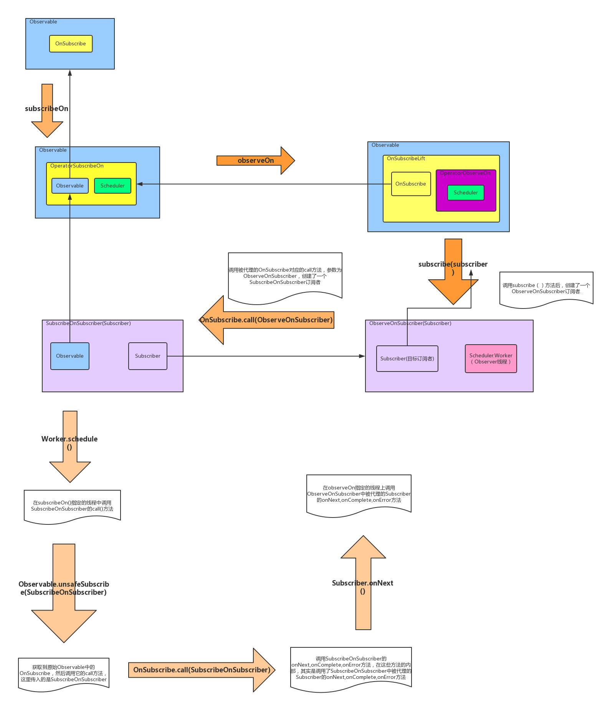

# 1
```java
Observable.subscribeOn()
```

```java
public final Observable<T> subscribeOn(Scheduler scheduler) {
    return subscribeOn(scheduler, !(this.onSubscribe instanceof OnSubscribeCreate));
}

public final Observable<T> subscribeOn(Scheduler scheduler, boolean requestOn) {
    if (this instanceof ScalarSynchronousObservable) {
        return ((ScalarSynchronousObservable<T>)this).scalarScheduleOn(scheduler);
    }
    return unsafeCreate(new OperatorSubscribeOn<T>(this, scheduler, requestOn));
}

public final class OperatorSubscribeOn<T> implements OnSubscribe<T> {
    final Scheduler scheduler;
    final Observable<T> source;
    final boolean requestOn;

    public OperatorSubscribeOn(Observable<T> source, Scheduler scheduler, boolean requestOn) {
        this.scheduler = scheduler;
        this.source = source;
        this.requestOn = requestOn;
    }
    ....
}

public static <T> Observable<T> unsafeCreate(OnSubscribe<T> f) {
    return new Observable<T>(RxJavaHooks.onCreate(f));
}
```
调用subscribeOn方法之后，实际上又创建了一个<code>OperatorSubscribeon</code>类型的<code>OnSubscribe</code>，并且把当前的<code>Observable</code>对象以及<code>scheduler</code>存储在<code>OperatorSubscribeon</code>中，最后通过<code>unsafeCreate</code>方法创建一个新的<code>Observable</code>并返回。

# 2
```java
Obserbable.observeOn()
```
```java
public final Observable<T> observeOn(Scheduler scheduler) {
    return observeOn(scheduler, RxRingBuffer.SIZE);
}

public final Observable<T> observeOn(Scheduler scheduler, int bufferSize) {
    return observeOn(scheduler, false, bufferSize);
}

public final Observable<T> observeOn(Scheduler scheduler, boolean delayError, int bufferSize) {
    if (this instanceof ScalarSynchronousObservable) {
        return ((ScalarSynchronousObservable<T>)this).scalarScheduleOn(scheduler);
    }
    return lift(new OperatorObserveOn<T>(scheduler, delayError, bufferSize));
}

public final <R> Observable<R> lift(final Operator<? extends R, ? super T> operator) {
    return unsafeCreate(new OnSubscribeLift<T, R>(onSubscribe, operator));
}

public interface Operator<R, T> extends Func1<Subscriber<? super R>, Subscriber<? super T>> {
    // cover for generics insanity
}

public final class OperatorObserveOn<T> implements Operator<T, T> {
    private final Scheduler scheduler;
    private final boolean delayError;
    private final int bufferSize;
    ...
    public OperatorObserveOn(Scheduler scheduler, boolean delayError, int bufferSize) {
        this.scheduler = scheduler;
        this.delayError = delayError;
        this.bufferSize = (bufferSize > 0) ? bufferSize : RxRingBuffer.SIZE;
    }
}

public final class OnSubscribeLift<T, R> implements OnSubscribe<R> {

    final OnSubscribe<T> parent;

    final Operator<? extends R, ? super T> operator;

    public OnSubscribeLift(OnSubscribe<T> parent, Operator<? extends R, ? super T> operator) {
        this.parent = parent;
        this.operator = operator;
    }
}
```
调用<code>obserbeOn</code>方法后，首先会创建一个<code>OperatorObserveOn</code>对象，这个对象实现了<code>Operator</code>接口，其中<code>Operator</code>接口继承至<code>Func1</code>接口和<code>Subscriber</code>抽象类。
然后调用<code>lift</code>方法，在这个方法中会将创建一个<code>OnSubscribelift</code>类型的<code>OnSubscribe</code>对象，并且会将上一步创建的</code>OperatorObserveOn</code>对象和当前<code>Observable</code>对象中的<code>OnSubscribe</code>对象保存在<code>OnSubscribelift</code>对象中。然后调用<code>unsafeCreate</code>方法创建一个新的<code>Observable</code>对象返回。

通过上面的分析可以知道，在调用<code>subscribeOn</code>方法后创建了一个新的Observable对象这个对象持有的的<code>OnSubscribe</code>对象中保存了原始<code>Observable</code>对象和<code>scheduler</code>的引用。
然后调用<code>obserbeOn</code>方法后也创建了一个新的<code>Observable</code>对象，这个对象持有的<code>OnSubscribe</code>对象中保存了原始<code>OnSubscribe</code>对象的引用，并且在这个新的<code>OnSubscribe</code>的对象中还持有一个<code>Operator</code>对象的引用。

# 3
在调用<code>subscribe</code>方法订阅事件的时候
```java
public final Subscription subscribe(final Action1<? super T> onNext) {
    if (onNext == null) {
        throw new IllegalArgumentException("onNext can not be null");
    }

    Action1<Throwable> onError = InternalObservableUtils.ERROR_NOT_IMPLEMENTED;
    Action0 onCompleted = Actions.empty();
    return subscribe(new ActionSubscriber<T>(onNext, onError, onCompleted));
}

public final Subscription subscribe(Subscriber<? super T> subscriber) {
    return Observable.subscribe(subscriber, this);
}

static <T> Subscription subscribe(Subscriber<? super T> subscriber, Observable<T> observable) {
    ...
    // new Subscriber so onStart it
    subscriber.onStart();//3.1
    ...
    RxJavaHooks.onObservableStart(observable, observable.onSubscribe).call(subscriber);//3.2
}
```
## 3.1
调用直接<code>subscribe</code>对象的<code>onStart</code>方法
## 3.2
调用<code>onSubscribe</code>对象的<code>call</code>方法。根据前面的分析这里的<code>onSubscribe</code>对象应该是调用<code>observeOn()</code>方法时新创建的<code>Observable</code>对象的中的<code>OnSubscribe</code>对象。那么这个<code>onSubscribe</code>对象的类型就是<code>OnSubscribeLift</code>
```java
public final class OnSubscribeLift<T, R> implements OnSubscribe<R> {
    @Override
    public void call(Subscriber<? super R> o) {
        try {
            Subscriber<? super T> st = RxJavaHooks.onObservableLift(operator).call(o);
            try {
                // new Subscriber created and being subscribed with so 'onStart' it
                st.onStart();
                parent.call(st);
            } catch (Throwable e) {
                // localized capture of errors rather than it skipping all operators
                // and ending up in the try/catch of the subscribe method which then
                // prevents onErrorResumeNext and other similar approaches to error handling
                Exceptions.throwIfFatal(e);
                st.onError(e);
            }
        } catch (Throwable e) {
            Exceptions.throwIfFatal(e);
            // if the lift function failed all we can do is pass the error to the final Subscriber
            // as we don't have the operator available to us
            o.onError(e);
        }
    }
}
```

