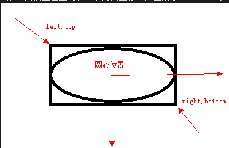
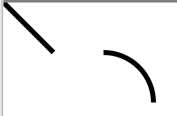
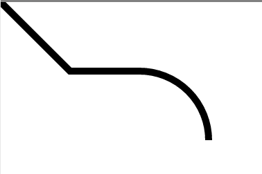
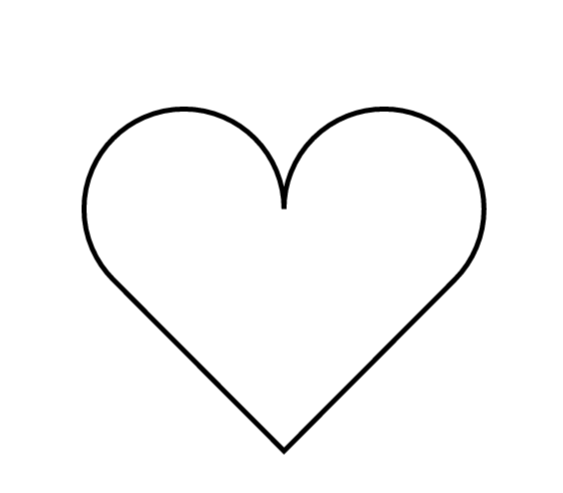
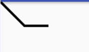
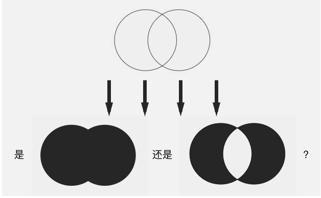
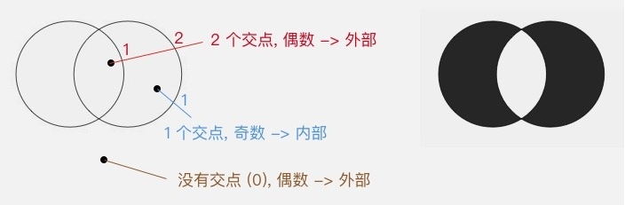
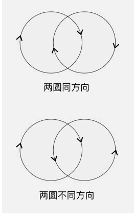
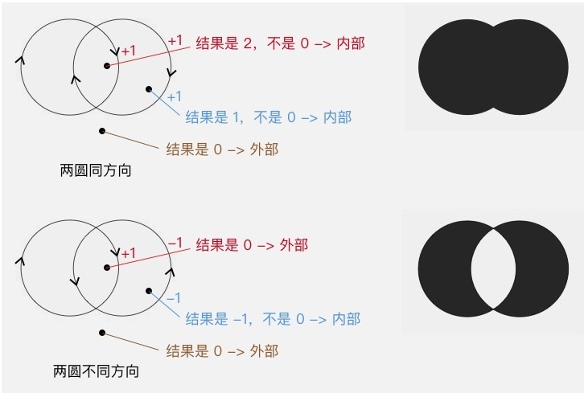
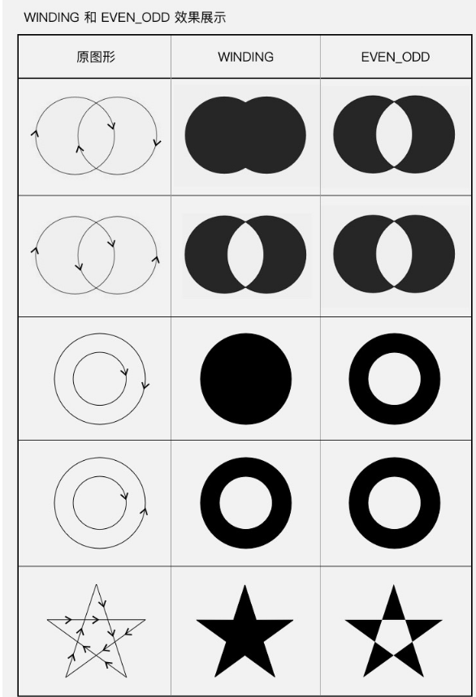

# canvas
* ## 画弧形或扇形
```java
//Canvas.java
public void drawArc(float left, float top, float right, float bottom, float startAngle,
            float sweepAngle, boolean useCenter, @NonNull Paint paint)
```
left,top,right,bottom是指弧形或扇形所在的椭圆左上角和右下角的坐标。如图所示：



startAngle是弧形的起始角度（x轴的正方向，即正右的方向，是0度的位置；顺时针为正角度，逆时针为负角度），sweepAngle是弧度划过的角度；
useCenter表示是否连接到圆心，如果不连接到圆心，就是弧形，如果连接到圆心，就是扇形。

* ## canvas.drawPoint()画点
```java
public void drawPoint (float x, float y, Paint paint)
```
x和y是点的坐标。点的大小可以通过pain.setStrokeWidth(width)来设置；点的形状可以通过paint.setStrokeCap(cap)来设置：ROUND画出来是圆形的点，SQUARE或BUTT画出来的是方形的点


# path
* ## path中画弧线
```java
//Path.java
//forceMoveTo--->true新建一个子图形，forceMove---->false不新建子图形
//如果arc的起点和当前path的终点不一致，会制动调用lineTo()连接上两点。如果path为空，会调用moveTo()移动到arc的起点。
public void arcTo (float left, float top, float right, float bottom, float startAngle, float sweepAngle, boolean forceMoveTo)
```
```java
paint.setStyle(Style.STROKE);
paint.lineTo(100,100);
paint.arcTo(100,100,300,300,-90,90,true);//forceMoveTo为true，新建一个子图形，path为空，所以是调用moveTo()，不会自动连接之前的终点和arc的起点
```

```java
paint.setStyle(Style.STROKE);
paint.lineTo(100,100);
paint.arcTo(100,100,300,300,-90,90,false);//forceMoveTo为false，不会新建子图形，而是在原来的图形上画，因为调用lineTo()连接两点
```


* ## path中添加弧线
```java
//Path.java
public void addArc (float left, float top, float right, float bottom, float startAngle, float sweepAngle)
```
这个方法和arcTo相当于arcTo使用forceMoveTo=true

* ## path.close()封闭当前图形
```java
public void close ()
```
**它的作用是把当前的<font color='red'>子图形封闭</font>，即由当前位置向当前子图形的起点绘制一条直线。close()和lineTo(起点坐标)是完全等价的。
<font color='red'>[子图形]:官方文档叫做contour，在path中使用addxxx()方法的时候，每一次方法调用都是新增了一个独立的子图形；而如果使用xxxTo()等方法的时候，则是每一次短线（即每一次抬笔<font color='blue'>moveTo</font>），都标志着一个子图形的结束，以及一个新的子图形的开始。</font>
另外，不是所有的子图形都需要使用close()来封闭。当需要填充图形时（即Paint.Style为FILL或FILL_AND_STROKE）,path会自动封闭子图形**

*例子*
```java
//画心型
Path path = new Path();
path.addArc(200, 200, 400, 400, -225, 225);
path.arcTo(400, 200, 600, 400, -180, 225, false);
path.lineTo(400,542);
path.close();
```


* ## path.rLineTo()
```java
public void rLineTo (float dx, float dy)
```
rLineTo(x,y)的参数是相对当前位置的相对坐标

*例子*
```java
Paint paint = new Paint();
paint.setStrokeWidth(10);
paint.setStyle(Paint.Style.STROKE);
paint.setColor(Color.BLACK);
paint.setAntiAlias(true);

Path path = new Path();
path.lineTo(100,100);
path.rLineTo(100, 0);//以相对于(100,100)，向右移动100

canvas.drawPath(path, paint);
```


* ## path.addCircle(),路径中添加圆
```java
public void addCircle (float x, float y, float radius, Path.Direction dir)
```
最后一个参数dir是画圆的路径的方向。
**路径方向有两种：顺时针（CW）和逆时针（ccw）。对于普通情况，这个参数天CW还是CCW没有影响。它只是需要填充图形（Paint.Style为FILL或FILL_AND_STROKE），并且图形出现自相交时，用于判断填充范围的。**

* ## path.setFillType设置填充方式
```java
public void setFillType (Path.FillType ft)
```
setFillType是用来设置图形自相交时的填充算法的


方法中填入不同的FILLType值，就会有不同的填充效果。FilleType的取值有4个
EVEN_ODD 
WINDING 
INVERSE_EVEN_ODD
INVERSE_WINDING

### EVEN_ODD 和 WINDING 的原理
>即 even-odd rule （奇偶原则）：对于平面中的任意一点，向任意方向射出一条射线，这条射线和图形相交的次数（相交才算，相切不算哦）如果是奇数，则这个点被认为在图形内部，是要被涂色的区域；如果是偶数，则这个点被认为在图形外部，是不被涂色的区域。还以左右相交的双圆为例：<br>
射线的方向无所谓，同一个点射向任何方向的射线，结果都是一样的，不信你可以试试。<br>
从上图可以看出，射线每穿过图形中的一条线，内外状态就发生一次切换，这就是为什么 EVEN_ODD 是一个「交叉填充」的模式。
### WINDING
>即 non-zero winding rule （非零环绕数原则）：首先，它需要你图形中的所有线条都是有绘制方向的：
<br>然后，同样是从平面中的点向任意方向射出一条射线，但计算规则不一样：以 0 为初始值，对于射线和图形的所有交点，遇到每个顺时针的交点（图形从射线的左边向右穿过）把结果加 1，遇到每个逆时针的交点（图形从射线的右边向左穿过）把结果减 1，最终把所有的交点都算上，得到的结果如果不是 0，则认为这个点在图形内部，是要被涂色的区域；如果是 0，则认为这个点在图形外部，是不被涂色的区域。<br>
<br>
**和 EVEN_ODD 相同，射线的方向并不影响结果。<br>**
**图形的方向：对于添加子图形类方法（如 Path.addCircle() Path.addRect()）的方向，由方法的 dir 参数来控制，这个在前面已经讲过了；而对于画线类的方法（如 Path.lineTo() Path.arcTo()）就更简单了，线的方向就是图形的方向。**<br>
所以，完整版的 EVEN_ODD 和 WINDING 的效果应该是这样的：<br>
而 INVERSE_EVEN_ODD 和 INVERSE_WINDING ，只是把这两种效果进行反转而已