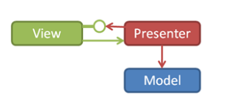
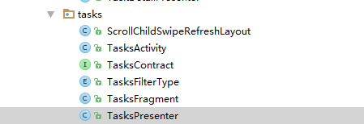
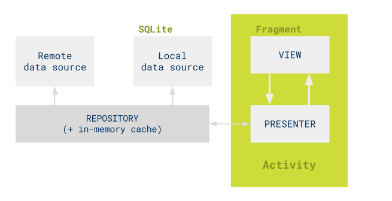

# MVP模式里通常包含4个要素:
1. View负责绘制UI元素、与用户进行交互（在Android中体现为Activity）。
2. View Interfacex需要View实现的接口，View通过View Interface与Presenter进行交互,降低耦合，方便进行单元测试。
3. Model 负责存储、检索、操纵数据。
4. presenter 作为View和Model交互的中间纽带,处理与用户交互的逻辑。



# Android todo-mvp分析

**注意：在一个MVP环境中，View项被重载**
* android.View.View这个类会被称为Android View
* 在MVP中从presenter接受命令的视图被简单的称为view 

Fragments<br/>
这个示例使用Fragments有两个原因：
* Activity和Fragment的分离非常符合这个实现的MVP：Activity是全体的控制器，它创建并连接views和presenters
* 平板电脑布局或显示多个视图的屏幕利用Fragments框架

关键概念
* Tasks
* TaskDetail
* AddEditTask
* Statistics

每个属性有：
* view和presenter定义一个合同
* Activity负责创建fragments和presenters
* Fragment实现view接口
* presenter实现presenter接口

一般来说，业务逻辑在presenter中，并且依赖view去做Android UI的工作。<br/>
view几乎不包含业务逻辑，它将presenter的命令转换为UI动作，并且监听用户动作传递给presenter。<br/>
合同接口用于定义views和presenters之间的联系。

***
## 以tasks为例进行分析
### 包结构如下：<br/>

* TasksContract接口定义了view接口和presenter接口。<br/>
* TasksPresenter实现了presenter接口。<br/>
* TasksFragments实现了view接口。<br/>
* TasksDataSource定义了获取数据的接口。<br/>
* FakeTasksRemoteDataSource实现了TasksDataSource接口,作为远程数据管理。<br/>
* TasksLocalDataSource实现了TasksDataSource接口,作为本地数据管理。<br/>
* TasksRepository实现了TasksDataSource接口，包含了TasksLocalDataSource和FakeTasksRemoteDataSource。<br/>

### 关系图如下:<br/>

### 代码实现
```java
public class TasksActivity extends AppCompatActivity {

    private static final String CURRENT_FILTERING_KEY = "CURRENT_FILTERING_KEY";

    private DrawerLayout mDrawerLayout;

    private TasksPresenter mTasksPresenter;//presenter

    @Override
    protected void onCreate(Bundle savedInstanceState) {
        ......
        ......
        TasksFragment tasksFragment =
                (TasksFragment) getSupportFragmentManager().findFragmentById(R.id.contentFrame);
        if (tasksFragment == null) {
            // Create the fragment
            tasksFragment = TasksFragment.newInstance();
            ActivityUtils.addFragmentToActivity(
                    getSupportFragmentManager(), tasksFragment, R.id.contentFrame);
        }

        // Create the presenter
        mTasksPresenter = new TasksPresenter(
                Injection.provideTasksRepository(getApplicationContext()), tasksFragment);
        ......
    }
}

public class Injection {

    public static TasksRepository provideTasksRepository(@NonNull Context context) {
        checkNotNull(context);
        return TasksRepository.getInstance(FakeTasksRemoteDataSource.getInstance(),
                TasksLocalDataSource.getInstance(context));
    }
}
//Model TasksRepository包含了本地和远程数据访问接口
public class TasksRepository implements TasksDataSource {
    private final TasksDataSource mTasksRemoteDataSource;

    private final TasksDataSource mTasksLocalDataSource;

    private TasksRepository(@NonNull TasksDataSource tasksRemoteDataSource,
                            @NonNull TasksDataSource tasksLocalDataSource) {
        mTasksRemoteDataSource = checkNotNull(tasksRemoteDataSource);//远程
        mTasksLocalDataSource = checkNotNull(tasksLocalDataSource);//本地
    }
    .....
}

//presenter 实现了presenter接口。
public class TasksPresenter implements TasksContract.Presenter {
    private final TasksRepository mTasksRepository;//数据访问接口

    private final TasksContract.View mTasksView;//view

    public TasksPresenter(@NonNull TasksRepository tasksRepository, @NonNull TasksContract.View tasksView) {
        mTasksRepository = checkNotNull(tasksRepository, "tasksRepository cannot be null");//绑定数据访问接口
        mTasksView = checkNotNull(tasksView, "tasksView cannot be null!");//presenter绑定view

        mTasksView.setPresenter(this);//view绑定presenter。操作完数据后调用相应的view接口通知view更新。
    }

    @Override
    public void start() {
        loadTasks(false);
    }

    @Override
    public void loadTasks(boolean forceUpdate) {
        // Simplification for sample: a network reload will be forced on first load.
        loadTasks(forceUpdate || mFirstLoad, true);
        mFirstLoad = false;
    }

    /**
     * @param forceUpdate   Pass in true to refresh the data in the {@link TasksDataSource}
     * @param showLoadingUI Pass in true to display a loading icon in the UI
     */
    private void loadTasks(boolean forceUpdate, final boolean showLoadingUI) {
        if (showLoadingUI) {
            mTasksView.setLoadingIndicator(true);
        }
        if (forceUpdate) {
            mTasksRepository.refreshTasks();
        }

        // The network request might be handled in a different thread so make sure Espresso knows
        // that the app is busy until the response is handled.
        EspressoIdlingResource.increment(); // App is busy until further notice

        mTasksRepository.getTasks(new TasksDataSource.LoadTasksCallback() {
            @Override
            public void onTasksLoaded(List<Task> tasks) {
                List<Task> tasksToShow = new ArrayList<Task>();

                // This callback may be called twice, once for the cache and once for loading
                // the data from the server API, so we check before decrementing, otherwise
                // it throws "Counter has been corrupted!" exception.
                if (!EspressoIdlingResource.getIdlingResource().isIdleNow()) {
                    EspressoIdlingResource.decrement(); // Set app as idle.
                }

                // We filter the tasks based on the requestType
                for (Task task : tasks) {
                    switch (mCurrentFiltering) {
                        case ALL_TASKS:
                            tasksToShow.add(task);
                            break;
                        case ACTIVE_TASKS:
                            if (task.isActive()) {
                                tasksToShow.add(task);
                            }
                            break;
                        case COMPLETED_TASKS:
                            if (task.isCompleted()) {
                                tasksToShow.add(task);
                            }
                            break;
                        default:
                            tasksToShow.add(task);
                            break;
                    }
                }
                // The view may not be able to handle UI updates anymore
                if (!mTasksView.isActive()) {
                    return;
                }
                if (showLoadingUI) {
                    mTasksView.setLoadingIndicator(false);
                }

                processTasks(tasksToShow);
            }

            @Override
            public void onDataNotAvailable() {
                // The view may not be able to handle UI updates anymore
                if (!mTasksView.isActive()) {
                    return;
                }
                mTasksView.showLoadingTasksError();
            }
        });
    }
}

//view 实现了view接口。在view中通过presenter和数据进行交互。
public class TasksFragment extends Fragment implements TasksContract.View {
    private TasksContract.Presenter mPresenter;//presenter

    @Override
    public void onResume() {
        super.onResume();
        mPresenter.start();
    }

    @Override
    public void setPresenter(@NonNull TasksContract.Presenter presenter) {
        mPresenter = checkNotNull(presenter);//view绑定presenter
    }
}

public interface TasksContract {

    interface View extends BaseView<Presenter> {

        void setLoadingIndicator(boolean active);

        void showTasks(List<Task> tasks);

        void showAddTask();

        void showTaskDetailsUi(String taskId);

        void showTaskMarkedComplete();

        void showTaskMarkedActive();

        void showCompletedTasksCleared();

        void showLoadingTasksError();

        void showNoTasks();

        void showActiveFilterLabel();

        void showCompletedFilterLabel();

        void showAllFilterLabel();

        void showNoActiveTasks();

        void showNoCompletedTasks();

        void showSuccessfullySavedMessage();

        boolean isActive();

        void showFilteringPopUpMenu();
    }

    interface Presenter extends BasePresenter {

        void result(int requestCode, int resultCode);

        void loadTasks(boolean forceUpdate);

        void addNewTask();

        void openTaskDetails(@NonNull Task requestedTask);

        void completeTask(@NonNull Task completedTask);

        void activateTask(@NonNull Task activeTask);

        void clearCompletedTasks();

        void setFiltering(TasksFilterType requestType);

        TasksFilterType getFiltering();
    }
}
```