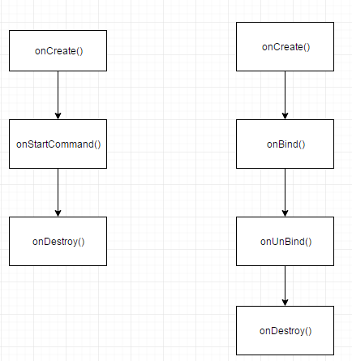

# Java知识
## java中==和equals和hashCode的区别
1.==是操作符，equals是方法
2.==比较的是两个对象的印象是否相同。equals是object里面的方法，object类里面equals默认实现就是用==进行比较的，所有object里面==和equals结果是一样的。
但是在一些类中如果覆盖了equals方法的话如string，通过equals比较的是两个对象指向的堆内存的值是否相等。
3.hashcode是对象的hash值。
***
## int、char、long各占多少字节数
int4字节，char2字节，long8字节，short2字节，double8字节
***
## int与integer的区别
int基本类型，Integer是int的封装类

通过Integer.valueOf(int i)方法获取Integer时，Integer会缓存-128~127之间的数据，如果不在-128~127之间则new一个Integer
```java
public static Integer valueOf(int i) {
    if (i >= IntegerCache.low && i <= IntegerCache.high)
        return IntegerCache.cache[i + (-IntegerCache.low)];
    return new Integer(i);
}

private static class IntegerCache {
    static final int low = -128;
    static final int high;
    static final Integer cache[];
    static {
        // high value may be configured by property
        int h = 127;
        String integerCacheHighPropValue =
            sun.misc.VM.getSavedProperty("java.lang.Integer.IntegerCache.high");
        if (integerCacheHighPropValue != null) {
            try {
                int i = parseInt(integerCacheHighPropValue);
                i = Math.max(i, 127);
                // Maximum array size is Integer.MAX_VALUE
                h = Math.min(i, Integer.MAX_VALUE - (-low) -1);
            } catch( NumberFormatException nfe) {
                // If the property cannot be parsed into an int, ignore it.
            }
        }
        high = h;

        cache = new Integer[(high - low) + 1];
        int j = low;
        for(int k = 0; k < cache.length; k++)
            cache[k] = new Integer(j++);

        // range [-128, 127] must be interned (JLS7 5.1.7)
        assert IntegerCache.high >= 127;
    }
}
```
Integer a = Integer.valueOf(10);
Integer b = Integer.valueOf(10);
a==b   true
a.equals(b)  true


Integer a = Integer.valueOf(128);
Integer b = Integer.valueOf(128);
a==b   false
a.equals(b)  true
***
## 谈谈对java多态的理解
多态跟继承有关和方法重写有关跟方法重载无关
父类引用指向子类对象，调用方法时会调用子类，而不是父类
***
## String、StringBuffer、StringBuilder区别
String不可变字符串，StringBuffer/StringBuilder可变字符串
StringBuffer是线程安全的（append方法上加了synchronized），StringBuilder非线程安全
***
## 什么是内部类？内部类的作用
1. 内部类：定义在一个类的内部
2. 内部类作用：多重继承，匿名内部类可以方便的实现闭包，静态内部类可以带来更好的代码聚合提供代码的维护性。
3. 内部类分为：成员内部类，局部内部类，匿名内部类，静态内部类
* 非静态内部类可以访问外部类的所有属性，非静态内部类里不能用static的字段和static方法。但是可以有static final字段。
* 静态内部类只能访问外部类的静态属性和方法，可以有静态和非静态方法和静态字段。
* 局部内部类和成员内部类基本一样只是作用域不同。局部内部类只能访问成员方法中的final变量
* 匿名内部类属于局部内部类。匿名内部类没有名字，只能是实例化一次，没有构造方法，不能使静态的
***
## 抽象类和接口区别
1. 抽象类要被子类继承，接口要被子类实现
2. 接口里面只能对方法进行生命，抽象类既可以对方法进行声明也可以实现
3. 抽象类主要是用来抽象类别的，接口主要是用来抽象方法功能的。
4. 抽象类可以有构造方法，接口没有
5. 抽象方法可以有public，protect，default访问修饰符，接口只能是public
**抽象类里可以没有抽象方法。如果一个类里面有抽象方法，那么这个类一定是抽象类**
***
## 抽象类是否可以没有方法和属性？
可以
***
## 抽象类的意义
为子类提供一个公共的类型，封装子类中重复的内容，子类虽然有不同的实现但是定义是一样的
***
## 接口的意义
1. 重要性：在Java语言中， abstract class 和interface 是支持抽象类定义的两种机制。正是由于这两种机制的存在，才赋予了Java强大的 面向对象能力。
2. 简单、规范性：如果一个项目比较庞大，那么就需要一个能理清所有业务的架构师来定义一些主要的接口，这些接口不仅告诉开发人员你需要实现那些业务，而且也将命名规范限制住了（防止一些开发人员随便命名导致别的程序员无法看明白）。
3. 维护、拓展性：比如你要做一个画板程序，其中里面有一个面板类，主要负责绘画功能，然后你就这样定义了这个类。可是在不久将来，你突然发现这个类满足不了你了，然后你又要重新设计这个类，更糟糕是你可能要放弃这个类，那么其他地方可能有引用他，这样修改起来很麻烦。如果你一开始定义一个接口，把绘制功能放在接口里，然后定义类时实现这个接口，然后你只要用这个接口去引用实现它的类就行了，以后要换的话只不过是引用另一个类而已，这样就达到维护、拓展的方便性。
4. 安全、严密性：接口是实现软件松耦合的重要手段，它描叙了系统对外的所有服务，而不涉及任何具体的实现细节。这样就比较安全、严密一些（一般软件服务商考虑的比较多）。
***
## 父类的静态方法能否被子类重写
不能。如果子类有同名的静态方法，子类会隐藏父类的静态方法。
***
## final，finally，finalize的区别
final 用来修饰类/变量/方法。final修饰的类不能被继承，final修饰的方法不能被重写，final修饰的变量不能更改。
finally和try catch一起。表示无论是否发生异常最后都会执行finally
finalize是object中的方法，垃圾回收器将对象回收之前调用此方法来释放资源
***
## 序列化的方式
实现serializable接口或者parcelable接口
***
## serializable和parcelable的区别
serializable会使用反射，在序列化的过程中产生了使用了反射，会产生许多的临时对象，容易触发垃圾回收。parcelable自己实现封装和解封操作不需要反射，效率更好。
实现parcelable接口需要实现，writeToParcel和实现一个内部类CREATOR（createFromParcel和newArray）
***
## 静态属性和静态方法是否可以被继承？是否可以被重写？以及原因？
静态属性和静态方法可以被继承，不能被重写
***
## 静态内部类的设计意图
静态内部类增加代码的聚合提高代码的维护性。静态内部类不依赖于外部类
***
## 哪些情况下的对象会被垃圾回收机制处理掉
### 1.如何确定一个对象是否可以被回收
通过判断对象的引用链是否可达。通过一系列的名为GC Roots的对象作为起始点，从这些节点开始向下搜索，搜索所走过的路径成为引用链，当一个对象到GC Roots没有任何引用链，即从GC Roots到这个对象不可达，则证明此对象是不可用的。
哪些对象可以作为GC Roots？
* 虚拟机栈中的引用的对象
* 方法区中的类静态属性引用的对象
* 方法区的常亮引用的对象
* 本地方法栈中Native方法引用的对象
### 2.垃圾收集算法
1. 标记清除算法  
标记-清除算法分为标记和清除两个阶段。该算法首次按从根集合进行扫描，对存活的对象进行标记，标记完毕后，在扫描整个空间中未被标记的对象并进行回收。
标记-清除算法的主要不足:
    * 效率问题：标记和清除两个过程的效率都不高
    * 空间问题：标记-清除算法不需要进行对象的移动，并且仅对不存货的对象进行处理，因此标记清除之后会产生大量不连续的内存碎片，空间碎片太多可能会导致以后再程序运行过程中需要分配大对象的时候，无法找到足够的连续内存而不得不提前触发另一次垃圾收集动作。
2. 复制算法  
复制算法将可用内存按容量划分为大小相等的两块，每次只是用其中的一块。当这一块的内存用完了，就将还存活着的对象复制到另外一块上面，然后再把已是用过的内存空间一次清理掉。这种算法适用于对象存活率低的场景，比如新生代。
3. 标记整理算法  
复制手机算法在对象存活率较高时就要进行较多的复制操作，效率将会变低。更关键的是，如果不想浪费50%的空间，就需要有额外的空间进行分配担保，以应对被使用的内存中所有对象都100%存活的极端情况，所以在老年代一般不能直接蒜用这种算法。标记整理算法的标记过程类似标记清除算法，但后续步骤不是直接对可回收对象进行清理，而是让所有存活的对象都向一端移动，然后直接清理掉端边界以外的内存，类似于磁盘整理的过程，改垃圾算法适用于对象存活率高的场景（老年代）。
4. 分代收集算法  
分代收集算法是基于这样一个事实：不同的对象的生命周期是不一样的，而不同声明周期的对象位于堆中不同的区域，因此对堆内存不同区域采用不同的策略进行回收可以提高JVM执行效率。java堆内存一般可以分为新生代、老年代、永久代。  
    * **新生代**  
    新生代的目标就是尽可能快速的手机掉那些生命周期短的对象，一般情况下，所有新生成的对象首先都是放在新生代的。新生代内存按照8:1:1的比例分为一个eden区和两个survivor（survivor0，survivor1）区，大部分对象在Eden区中。在进行垃圾回收时，先将eden区存活对象复制到survivor0区，然后清空eden区，当这个survivor0区也满了时，则将eden区和survivor0区存活对象复制到survivor1区，然后清空eden和这个survivor0区，此时survivor0区是空的，然后交换survivor0和survivor1区的角色（即下次垃圾回收时会扫描eden区和survivor1区），即保持survivor0区为空，如此往复。特别的，当survivor1区也不足以存放eden区和survivor区存活对象时，就将存活对象直接存放到年老代。如果老年代也满了，就会触发一次FullGC，也就是新生代、老年代都进行回收。注意，新生代发生的GC也叫做MinorGC，MinorGC发生频率较高，不一定等Eden区满了才触发。  
    * **老年代**  
    老年代存放的都是一些生命周期较长的对象，就像上面所叙述的那样，在新生代中经历了N次垃圾回收后仍然存活的对象就会被放到老年代中。此外，老年代的内存也比新生代大很多，当老年代满时会触发Major GC（Full GC），老年代对象存活时间较长，因此FullGC发生的频率比较低。  
    * **永久代**  
    永久代主要存放静态文件，如Java类、方法等。永久代对垃圾回收没有显著影响，但是有些应用可能动态生成或者调用一些class，例如使用反射、动态代理、CGLib等bytecode框架时，在这种时候需要设置一个比较大的永久代空间来存放这些运行过程中新增的类。
5. 小结  
由于对象进行了分代处理，因此垃圾回收区域、时间也不一样。垃圾回收有两种类型，MinorGC和FullGC。
MinorGC：对新生代进行回收，不会影响到老年代。因为新生代的Java对象大多死亡频繁，所以MinorGC非常频繁，一般这里使用速度快、效率高的算法，使垃圾回收能尽快完成。
FullGC：也叫MajorGC，对整个堆进行回收，包括新生代和老年代。由于FullGC需要对整个堆进行回收，所以比MinorGC要慢，因此应该尽可能减少FullGC的次数，导致FullGC的原因包括：老年代被写满、永久代被写满、和System.gc()被显示调用等。  
<font color='red'>  
绝大多数刚创建的对象会被分配在Eden区，其中的大多数对象很快就会消亡。Eden区是连续的内存空间，因此在其上分配内存极快；
    * 最初一次，当Eden区满的时候，执行Minor GC，将消亡的对象清理掉，并将剩余的对象复制到一个存活区Survivor0（此时，Survivor1是空白的，两个Survivor总有一个是空白的）；
    * 下次Eden区满了，再执行一次Minor GC，将消亡的对象清理掉，将存活的对象复制到Survivor1中，然后清空Eden区；将Survivor0中消亡的对象清理掉，将其中可以晋级的对象晋级到Old区，将存活的对象也复制到Survivor1区，然后清空Survivor0区；
    * 当两个存活区切换了几次（HotSpot虚拟机默认15次，用-XX:MaxTenuringThreshold控制，大于该值进入老年代，但这只是个最大值，并不代表一定是这个值）之后，仍然存活的对象（其实只有一小部分，比如，我们自己定义的对象），将被复制到老年代。
    * 当年老代内存不足时，将执行Major GC，也叫 Full GC  
**如果对象比较大（比如长字符串或大数组），Young空间不足，则大对象会直接分配到老年代上**
</font>  
***
## 静态代理和动态代理的区别，什么场景使用？
### 动态代理原理
系统通过反射的反射创建一个代理类，这个代理类继承proxy类实现了目标接口。持有一个InvocationHandler对象。
调用代理类的方法时，最后都会调用到这个InvocationHandler对象的invoke方法。
生成代理类的大致代码
```java
public final class $Proxy1 extends Proxy implements Subject{
    private InvocationHandler h;
    private $Proxy1(){}
    public $Proxy1(InvocationHandler h){
        this.h = h;
    }
    public int request(int i){
      	// 创建 method 对象
        Method method = Subject.class.getMethod("request", new Class[]{int.class});
      	// 调用了 invoke() 方法
        return (Integer)h.invoke(this, method, new Object[]{new Integer(i)}); 
    }
}
```
***
## Java的异常体系
1. Throwable是所有异常和错误的父类，有两个子类Error和Exception。
    * Error是程序无法处理的错误，比如OutofMemoryError、ThreadDeath，这些错误发生时，Java虚拟机一般会选择终止线程。
    * Exception是程序本身可以处理的异常，这种异常分为两大类运行时异常和非运行时异常。
        1. 运行时异常是RuntimeException类及其子类异常，如NullPointerException、IndexOutOfBoundsException等。这些异常是不检查异常，程序可以选择捕获处理，也可以不处理。这些异常一般是由于程序逻辑错误引起的、
        2. 非运行时异常是RuntimeException以外的异常，类型都属于Exception类及其子类。一般属于必须要处理的异常，如果不处理程序编译不通过。如IOException

2. try语句块，表示要尝试运行代码，try语句块中代码受异常监控，其中代码发生异常时，会抛出异常对象。 catch语句块会捕获try代码块中发生的异常并在其代码块中做异常处理。finally语句块是紧跟catch语句后的语句块，这个语句块总是会在方法返回前执行
3. throw、throws关键字  
    * throw关键字是用于方法体内部，用来抛出一个Throwable类型的异常。如果抛出了非运行时异常，则还应该在方法头部声明方法可能抛出的异常类型，该方法的调用者也必须检查处理抛出的异常。如果抛出的是Error或RuntimeException，则该方法的调用者可选择处理该异常。  
    * throws关键字用于方法体外部的方法声明部分,用来声明方法可能会抛出某些异常。仅当抛出了检查异常，该方法的调用者才必须处理或者重新抛出该异常。
***
## 谈谈你对解析与分派的认识。
1. 解析
方法在程序真正运行之前就有一个可以确定的调用版本，并且这个方法调用版本在运行期间是不可改变的，即“编译期可知，运行期不可变”，这类目标的方法的调用成为**解析**
符合条件的有静态方法、私有方法、实例构造方法、父类方法
2. 分派
解析调用一定是个静态的过程，在编译期就完全确定，在类加载的解析阶段就将涉及的符号引用全部转变为可以确定的直接引用，不会延迟到运行期再去完成。而分派调用则可能是静态的也可能是动态的。分派是多态性的体现。Java虚拟机底层提供了我们开发中“重载”和“重写”的底层实现。其中重载属于静态分派，而重写则是动态分派。
***
## Java中实现多态的机制是什么？
通过继承，定义一个父类的引用，调用是执行的是子类的方法。
***
## 如何将一个Java对象序列化到文件里？
实现serializable接口，然后通过objectoutputstream将对象写入到文件。
***
## Java中的字符串常量池
Java中字符串对象创建有两种形式，一种为字面量形式，如
```java
String str="droid"
```
另一种就是使用new这种标准的构造对象的方法，如
```java
String str = new String("droid");
```
这两种方式我们在代码编写时都经常使用，尤其是字面量的方式。然后这两种实现其实存在着一些性能和内存占用的差别。这一切都是源于JVM为了减少字符串对象的重复创建，其维护了一个特殊的内存，这端内存被称为字符串常量池或者字符串字面量池。
### 工作原理
当代码中出现字面量形式创建字符串对象是，JVM首先会对这个字面量进行检查，如果字符串常量池中存在相同内容的字符串对象的引用，则将这个引用返回，否则新的字符串对象被创建，然后将这个引用放入字符串常量池，并返回该引用。
### 举例说明
#### 字面量创建形式
```java
String str1 = "droid";
```
JVM检测这个字面量，这里我们认为没有内容为droid的对象存在。jvm通过字符串常量池查不到内容为droid的字符串对象存在，那么会创建这个字符串对象，然后将刚创建的对象的引用放入到字符串常量池中，并且将引用返回给变量str1.  

如果接下来有这样一段代码
```java
String str2 = "droid";
```
同样jvm还是要检测这个字面量，jvm通过查找字符串常量池，发现内容为“droid”字符串对象存在，于是将已经存在的字符串对象的引用返回给变量str2.<font color='red'>注意这里不会重新创建新的字符串对象。</font>

验证是否为str1和str2是否指向同一对象，我们可以通过这段代码
```java
System.out.println(str1 == str2);
```
结果为true
### 使用new创建
```java
String str3 = new String("droid");
```
1. 在常量池中查找是否有内容为“droid”的字符串对象
    * 有则返回对应的引用
    * 没有则创建对应字符串对象，然后放入到字符串常量池中
2. 在堆中new一个String("droid")对象
3. 将引用返回给变量str3

所以，常量池中没有“droid”字面量则创建两个对象，否则创建一个对象。

当我们使用了new来构造字符串对象的时候，不管字符串常量池中有没有相同内容的对象的引用，新的字符串对象都会创建。因此我们使用下面代码测试一下，
```java
String str3 = new String("droid");
System.out.println(str1 == str3);
```
结果如我们所想，为false，表明这两个变量指向的为不同的对象。

#### intern
对于上面使用new创建的字符串对象，如果想将这个对象的引用加入到字符串常量池，可以使用intern方法。

调用intern后，首先检查字符串常量池中是否有改对象的引用，如果存在，则将这个引用返回给变量，否则将引用加入并返回给变量。
```java
String str4 = str3.intern();
System.out.println(str4 == str1);
```
输出的结果为true。
#### 总有例外？
你知道下面的代码，会创建几个字符串对象，在字符串常量池中保存几个引用么？
```java
String test = "a" + "b" + "c";
```
答案是只创建了一个对象，在常量池中也只保存一个引用。我们使用javap反编译看一下即可得知。
实际上在编译期间，已经将这三个字面量合成了一个。这样做实际上是一种优化，避免了创建多余的字符串对象，也没有发生字符串拼接问题.
***
## Integer的缓存策略
在Integer中有一个静态内部类IntegerCache，在IntegerCache有一个静态的Integer数组，在类加载时就将-128到127的Integer对象创建了，并保存在cache数组中。一旦程序调用valueOf方法，如果i的值在-128到127之间就直接在cache缓存数组中去取Integer对象。
```java
Integer a = 12;
//编译期会调用
Integer a = Integer.valueOf(12);
```
```java
 public static Integer valueOf(int i) {    
     if(i >= -128 && i <= IntegerCache.high)    
         return IntegerCache.cache[i + 128];    
     else    
         return new Integer(i);    
 } 

 private static class IntegerCache {    
     static final int high;    
     static final Integer cache[];    
  
     static {    
         final int low = -128;    
  
         // high value may be configured by property    
         int h = 127;    
         if (integerCacheHighPropValue != null) {    
             // Use Long.decode here to avoid invoking methods that    
             // require Integer's autoboxing cache to be initialized    
             int i = Long.decode(integerCacheHighPropValue).intValue();    
             i = Math.max(i, 127);    
             // Maximum array size is Integer.MAX_VALUE    
             h = Math.min(i, Integer.MAX_VALUE - -low);    
         }    
         high = h;    
  
         cache = new Integer[(high - low) + 1];    
         int j = low;    
         for(int k = 0; k < cache.length; k++) //缓存区间数据    
             cache[k] = new Integer(j++);    
     }    
  
     private IntegerCache() {}    
 }
```
再看其它的包装器：

Boolean：(全部缓存)  
Byte：(全部缓存)  
Character(<= 127缓存)  
Short(-128 — 127缓存)  
Long(-128 — 127缓存)  
Float(没有缓存)  
Doulbe(没有缓存)  
***

# 数据结构

## 常用数据结构简介
list、set、map
list、set实现collection接口
map一个key、value键值对

### List有序列表
1. ArrayList实现了可变大小的数组，它允许所有元素，包括null。ArrayList没有同步。
2. LinkedList实现方式是链表，允许null，没有同步。
3. Vector底层实现也是数组，但是Vector是同步的（为所有的方法都加上了synchronized）
### set不包含重复元素，最多有一个null元素
set结构其实就是维护一个map来存储数据的，利用map接口key值唯一性（把set中数据作为map的key）
### map 键值对，key唯一，key可以为null
HashMap结构的实现原理是将put进来的key-value封装成一个Entry对象存储到一个Entry数组中，数组下标有key的哈希值与数组长度计算而来。如果数组当前下标已有值，把新的Entry的next指向原来的Entry，然后把新的Entry插入的数组中。
### HashSet与Treeset的适用场景
1. TreeSet是二叉树实现的。TreeSet中的数据是自动排好序，不允许放入null值。
2. HashSet是哈希表实现的，HashSet中的数据是无序的，可以放入null，但只能放入一个null，两者中的值不能重复。
3. HashSet要求放入的对象必须实现hashCode()方法，放入的对象是以hashCode码作为标识的，而具有相同内容的String对象，hashCode是一样的，所以放入的内容不能重复。
4. HashSet是基于hash算法实现的，其性能通常优于TreeSet。为快速查找而设计的set，我们通常都应该使用HashSet。在我们需要排序功能时，我们采用TreeSet。

### HashMap与TreeMap、HashTable的区别及适用场景
1. HashMap非线程安全
2. HashMap基于hash表实现。使用HashMap要求添加的键的类明确定义了hashCode()和equals()方法，为了优化HashMap的空间的使用，可以调优初始容量和负载因子。其中散列表的冲突处理主要有两种，一种是开放定址法，另一种是链表法。HashMap的实现中采用了链表法。
3. TreeMap非线程安全基于红黑树实现。TreeMap没有调优选项，因为该树总处于平衡状态。
4. HashTable线程安全，不允许null键
5. HashMap适用于Map中插入,删除和定位元素
6. TreeMap适用于按自然顺序或自定义顺序遍历key

***
## 常用并发集合
ConcurrentHashmap：ConcurrentHashMap作为一种线程安全且高效的哈希表的解决方案，尤其其中的“分段锁”的方案，相比HashTable的全表锁在性能上的提升非常之大
***

## 二叉树的深度优先遍历和广度优先遍历的具体实现
```java
import java.util.ArrayDeque;

public class BinaryTree {

	private TreeNode root;

	public BinaryTree() {
		int a[] = new int[10];
		createBinaryTree(a);
	}

	private void createBinaryTree(int[] values) {
		TreeNode node = new TreeNode(2);
		TreeNode node1 = new TreeNode(3);
		TreeNode node2 = new TreeNode(4);
		node.left = node1;
		node.right = node2;

		TreeNode node3 = new TreeNode(5);
		TreeNode node4 = new TreeNode(6);
		node1.left = node3;
		node1.right = node4;

		TreeNode node5 = new TreeNode(7);
		TreeNode node6 = new TreeNode(8);
		node2.left = node5;
		node2.right = node6;

		TreeNode node7 = new TreeNode(9);
		TreeNode node8 = new TreeNode(10);
		node3.left = node7;
		node3.right = node8;

		TreeNode node9 = new TreeNode(11);
		node4.left = node9;
		root = node;
	}

	/**
	 * 先序遍历
	 */
	public void preOrder() {
		if (root == null)
			return;
		preOrderHelp(root);
	}

	private void preOrderHelp(TreeNode node) {
		if (node == null)
			return;
		System.out.print(node.value + " ");
		preOrderHelp(node.left);

		preOrderHelp(node.right);
	}

	/**
	 * 中序遍历
	 */
	public void inOrder() {
		if (root == null)
			return;
		inOrderHelp(root);
	}

	private void inOrderHelp(TreeNode node) {
		if (node == null)
			return;
		inOrderHelp(node.left);
		System.out.print(node.value + " ");
		inOrderHelp(node.right);
	}

	/**
	 * 后序遍历
	 */
	public void postOrder() {
		if (root == null)
			return;
		postOrderHelp(root);
	}

	private void postOrderHelp(TreeNode node) {
		if (node == null)
			return;
		postOrderHelp(node.left);
		postOrderHelp(node.right);
		System.out.print(node.value + " ");
	}

	/**
	 * 广度优先
	 */
	public void breadth_travel() {
		if (root == null)
			return;
		ArrayDeque<TreeNode> queue = new ArrayDeque<>();
		queue.add(root);
		while (!queue.isEmpty()) {
			TreeNode node = queue.remove();
			if (node != null) {
				System.out.print(node.value + " ");
				if (node.left != null) {
					queue.add(node.left);
				}
				if (node.right != null) {
					queue.add(node.right);
				}
			}

		}
	}

	private class TreeNode {
		TreeNode left;
		TreeNode right;
		int value;

		public TreeNode(int value) {
			this.value = value;
			this.left = null;
			this.right = null;
		}
	}
}
```
***
## 什么是深拷贝和浅拷贝
如果在拷贝这个对象的时候，只对基础对象进行了拷贝，而引用对象只是进行了引用的传递，而没有真实的创建一个新的对象，则认为是浅拷贝。反之，在对引用对象进行拷贝的时候，创建了一个新的对象，并且复制其内的成员变量，则认为是深拷贝。
Object类中的clone方法是浅拷贝。
如果要实现深拷贝，需要实现cloneable接口，clone方法中，调用对象中引用类型变量的clone方法。
```java
class Demo implements Cloneable {
	int a = 23;
	Demo2 b = new Demo2();

	@Override
	protected Object clone() throws CloneNotSupportedException {
		Demo demo = (Demo) super.clone();
		demo.b = (Demo2) demo.b.clone();
		return demo;
	}
}

class Demo2 implements Cloneable {
	String a = "asdfasd";

	@Override
	protected Object clone() throws CloneNotSupportedException {
		// TODO Auto-generated method stub
		return super.clone();
	}

}
```
***
# 线程
## 开启线程的三种方式？
1. 继承Thread类，实现Thread类中的run方法，调用Thread对象的start方法开启线程。
2. 创建Thread对象时传入runnable参数，调用Thread对象的start方法开启线程。
3. 实现Callable接口（jdk5以后）
```java
FutureTask<Integer> ft = new FutureTask<Integer>(new Callable<Integer>() {
	public Integer call() throws Exception {
		return null;
	}
});
new Thread(ft).start();
```
***
## 线程和进程的区别？
进程是cpu资源分配的最小单位,线程是cpu调度的最小单位。线程是建立在进程的基础上的一次程序运行单位。
***
## run()和start()方法区别
1. start()用来启动线程
2. run()是普通方法调用
***
## 如何控制某个方法允许并发访问线程的个数？
通过Semaphore类。Semaphore.acquire()请求一个信号量，这个时候信号量个数减一（一旦没有可用的信号量即信号量的个数为负数时，再次请求的时候就会阻塞，知道有其他线程释放了这个信号量）。Semaphore.release()释放一个信号量，此时信号量个数加1
***
## 在Java中wait和sleep方法的不同；
1. wait是Object类中的方法，sleep是Thread类中的方法
2. wait是线程处于阻塞状态并释放锁，sleep使线程处于阻塞状态不会释放锁
3. wait时间到或者其他线程调用了notify()方法后，wait还需要在锁池中获取锁，然后线程变为可运行状态。Sleep时间结束后线程直接变为可运行状态。
4. wait需要在同步代码块中执行。sleep不需要。  

***
## 谈谈wait/notify关键字的理解
wait/notify都是object类中的方法。
1. wait  
调用wait方法需要在synchronize作用域中。当调用了wait()线程从运行状态变为阻塞状态，同时线程释放掉对象锁。线程阻塞，挂起等待被唤醒。
2. notify  
调用notify方法也需要在synchronize作用域中。在Y线程中调用了某个对象的notify()方法后，阻塞的线程x会重新请求对象锁。当y线程运行处synchronize的作用域后，释放掉对象锁。此时x线程的到对象锁，线程变为就绪状态，等待cpu调度执行。
***
## 什么导致线程阻塞？
线程放弃cpu时间片，进入阻塞状态。
1. sleep()方法：sleep()允许指定一毫秒为单位的一段时间作为参数，它使得线程在指定的时间内进入阻塞状态，不能得到cpu时间片，指定的时间一过，线程重新进入可执行状态。
2. suspend()和resume()方法：两个方法配套使用，suspend()使得线程进入阻塞状态，并且不会自动恢复，必须其对应的resume()被调用，才能使得线程重新进入可执行状态。
3. yield()方法：yield()使得线程放弃当前分得的cpu时间片，但是不使线程阻塞，即线程仍处于可执行状态，随时可能再次分得cpu时间。调用yield()的效果等价于调度程序认为该线程已执行了足够的时间从而转到另一个线程。
4. wait()和notify()方法：两个方法配套使用，wait()使得线程进入阻塞状态，它有两种形式，一种允许指定以毫秒为单位的一段时间作为参数，另一种没有参数，前者当对应的notify()被调用或者超出指定时间时线程重新进入可执行状态，后者则必须对应的notify()被调用。  
初看起来wait/notify和suspend/resume方法没有什么分别，但是事实上它们是截然不同的。<font color='red' size='5'>区别的核心在于，前面叙述的所有方法，阻塞时都不会释放占用的锁，而这一对方法则相反。</font>
***
## 线程如何关闭？
在Java中有一下3种方法可以终止正在运行的线程：
1. 使用退出标记，使线程正常退出，也就是run()方法完成后线程终止。
2. 使用stop()方法强行终止，但是不推荐这个方法，因为stop()是过期作废的方法。
3. 使用interrupt()方法中断线程。

> 一个线程不应该由其他线程来强制中断或停止，而是应该由线程自己自行停止。
所以，Thread.stop,Thread.suspend,Thread.resume都已经废弃了。（这种方式太过暴力而且是不安全的，线程A调用线程B的stop方法停止线程B，调用这个方法的时候线程A其实并不知道线程B执行的具体情况，这种突然间地停止会导致线程B的一些清理工作无法完成，还有一种情况是执行stop方法后线程B会马上释放锁，这有可能引发数据不同问题。基于以上这些问题，stop方法被抛弃了）  
而Thread.interrupt的作用其实也不是中断线程，而是[通知线程应该中断了]，具体到底中断还是继续运行，应该由被通知的线程自己处理。
具体来说，对一个线程，调用interrupt()时:
1. 如果线程处于阻塞状态(例如处于sleep，wait，join等状态)，那么线程将立即退出被阻塞状态，并抛出一个InterruptedException异常。仅此而已。
2. 如果线程处于正常活动状态，那么会将线程的中断标志设置为true，仅此而已。被设置中断标志的线程将继续正常运行，不受影响。  
interrupt()并不能真正的中断线程，需要被调用的线程自己进行配合才行。也就是说，一个线程如果有被中断的需求，那么就可以这样做：
1. 在正常运行任务时，经常检查本线程的中断标志，如果被设置了中断标志就自动停止线程。
2. 在调用阻塞方法时正确处理InterruptedException异常。
```java
Thead thread = new Thread(new Runnable() {
				
	@Override
	public void run() {
		while(!Thread.interrupted()){
			//do more work
		}
	}
});
thread.start();

//一段时间后
thread.interrupt();
```
Thread.interrupted()方法能够检查线程是否设置了中断表示，如果设置了中断标志然后清除中断标志。
***
## 讲一下java中的同步的方法
1. synchronized
* 把代码块声明为synchronized，有两个重要后果，通常是指改代码具有原子性和可见性。
>原子性：原子性意味着每个时刻，只有一个线程能够执行一段代码，这段代码通过一个monitor object保护，从而防止多个线程在更新共享状态时相互冲突。  
>可见性：可见性则更为秒，它要对付内存缓存和编译器优化的各种反常行为。它必须确保释放锁之前对共享数据做出的更改对于随后获得该锁的另一个线程时可见的。  
**作用**：如果没有同步机制提供的这种可见性保证，线程看到的共享变量可能是修改前的值或不一致的值，这将引发许多严重问题。
**原理**：当对象获取锁时，它首先是自己的高速缓存无效，这样就可以保证直接从主内存中装入变量。同样，在对象释放锁之前，它会刷新其高速缓存，强制使已做的任何更改都出现在主内存中。这样，会保证在同一个锁上同步的两个线程看到在synchronized块内修改的变量的相同值。
* synchronized是不错，但它并不完美。它有一些功能性的限制：
	1. 它无法中断一个正在等候获得锁的线程
	2. 也无法通过投票得到锁，如果不想等下去，也就没法得到锁
	3. 同步还要求锁的释放只能在与获得锁所在的堆栈帧相同的堆栈帧中进行，多数情况下，这没问题，但是，确实存在一些非块结构的锁更合适的情况。
2. ReentrantLock
java.util.concurrent.lock中的lock框架是锁定的一个抽象，它允许把锁定的实现作为一个Java类，而不是作为语言的特性来实现。这就为Lock的多种实现留下了空间。
ReentrantLock类实现了Lock，它拥有与synchronized相同的并发性和内存语义，但是添加了类似锁投票、定时锁等候和可中断锁等候的一些特性。
```java
Lock lock=new ReentrantLock(true);//公平锁
Lock lock=new ReentrantLock(false);//非公平锁
```
公平锁指的是线程获取锁的顺序是按照加锁顺序来的，而非公平锁指的是抢锁机制，先lock的线程不一定先获得锁。 
```java
tryLock能获得锁就返回true，不能就立即返回false，tryLock(long timeout,TimeUnit unit)，可以增加时间限制，如果超过该时间段还没获得锁，返回false
lock能获得锁就返回true，不能的话一直等待获得锁
lock和lockInterruptibly，如果两个线程分别执行这两个方法，但此时中断这两个线程，前者不会抛出异常，而后者会抛出异常
```
4. volatile
	1. 内存模型
	Java内存模型规定所有的变量都是存在主存当中，每个线程都有自己的工作内存。线程对变量的所有操作都必须在工作内存中进行，而不能直接对主存进行操作。并且每个线程不能访问其他线程的工作内存。
	2. 原子性  
		在Java中，对基本数据类型的变量的读取和赋值操作是原子性操作，即这些是不可被中断的，要么执行，要么不执行。  
		分析以下哪些操作是原子性操作：
		```java
		x = 10;         //语句1
		y = x;         //语句2
		x++;           //语句3
		x = x + 1;     //语句4
		```
		咋一看，有些朋友可能会说上面的4个语句中的操作都是原子性操作。其实只有语句1是原子性操作，其他三个语句都不是原子性操作。

		语句1是直接将数值10赋值给x，也就是说线程执行这个语句会直接将数值10写入到工作内存中。  
		语句2实际上包含2个操作，他先要去读取x的值，再将x的值写入工作内存，虽然读取x的值以及将x的值写入工作内存这两个操作都是原子性操作，但是合起来就不是原子性操作了。  
		同样的，x++和x = x+1包括3个操作：读取x的值，进行加1操作，写入新的值。  
		所以上面4个语句只有语句1的操作具备原子性。

		也就是说，只有简单的读取、赋值（而且必须是将数字赋值给某个变量，变量之间的相互赋值不是原子操作）才是原子操作。

		从上面可以看出，java内存模型只保证了基本读取和赋值是原子性操作，如果要实现更大范围操作的原子性，可以通过synchronized和lock来实现。由于synchronized和lock能够保证任何一时刻只有一个线程执行该代码块，那么自然就不存在原子性问题了，从而保证原子性。
	3. 可见性  
		对于可见性，Java提供了volatile关键字来保证可见性。
		当一个共享变量被volatile修饰时，它会保证修改的值会立即被更新到主存，当有其他线程需要读取时，它会去内存中读取新值。

		而普通的共享变量不能保证可见性，因为普通共享变量修改之后，什么时候被写入主存时不确定的，当其他线程去读取时，此时内存中可能还是原来的旧值，因此无法保证可见性。

		另外，通过synchronized和Lock也能保证可见性，synchronized和Lock能够保证同一时刻只有一个线程获取锁执行同步代码，并且在释放锁之前会将对变量的修改刷新到主存当中。因此可以保证可见性。
	4. 有序性  
		在Java内存模型中，允许编译器和处理器对指令进行重排序，但是重排序过程不会影响到单线程程序的执行，却会影响到多线程兵法执行的正确性。

		在Java里面，可以通过volatile关键字来保证一定的“有序性”。另外可通过synchronized和Lock来保证有序性，很显然，synchronized和Lock保证每个时刻只有一个线程执行同步代码，相当于是让线程顺序执行同步代码，自然就会保证了有序性。
		
		另外，<font color='red'>Java内存模型具备一些先天的“有序性”，即不需要通过任何手段就能得到保证的有序性，这个通常也成为happens-before原则。如果两个操作的执行次序无法从happens-before原则推导出来，那么他们就不能保证它们的有序性，虚拟机可以随意地对它们进行重排序。</font>
		下面就来具体介绍下happens-before原则（先行发生原则）:
		* 程序次序规则：一个线程内，按照代码顺序，书写在前面的操作先行发生于书写在后面的操作
		* 锁定规则：一个unLoack操作先行发生于后面对同一个锁的lock操作
		* volatile变量规则：对一个变量的写操作先行发生于后面对这个变量的读操作
		* 传递规则：如果操作A先行发生于操作B，而操作B有先行发生于操作C，则可以得出操作A先行发生于操作C
		* 线程启动规则：Thread对象的start()方法先行发生于次线程的每一个动作
		* 线程中断规则：对县城interrupt()方法的调用先行发生于被中断线程的代码检测到中断事件的发生
		* 线程终结规则：线程中所有的操作都先行发生于线程的终止检测，我们可以通过Thread.join()方法结束、Thread.isAlive()的返回值手段检测到线程已经终止执行
		* 对象终结规则：一个对象的初始化完成先行发生于他的finalize()方法的开始

		对于程序次序规则来说，我的理解就是一段程序代码的执行在单个线程中看起来是有序的。注意，虽然这条规则中提到“书写在前面的操作先行发生于书写在后面的操作”，这个应该是程序看起来执行的顺序是按照代码顺序执行的，因为虚拟机可能会对程序代码进行指令重排序。虽然进行重排序，但是最终执行的结果是与程序顺序执行的结果一致的，它只会对不存在数据依赖性的指令进行重排序。因此，在单个线程中，程序执行看起来是有序执行的，这一点要注意理解。事实上，这个规则是用来保证程序在单线程中执行结果的正确性，但无法保证程序在多线程中执行的正确性。

		第二条规则也比较容易理解，也就是说无论在单线程中还是多线程中，同一个锁如果出于被锁定的状态，那么必须先对锁进行了释放操作，后面才能继续进行lock操作。

		第三条规则是一条比较重要的规则，也是后文将要重点讲述的内容。直观地解释就是，如果一个线程先去写一个变量，然后一个线程去进行读取，那么写入操作肯定会先行发生于读操作。
		
		第四条规则实际上就是体现happens-before原则具备传递性。

		<font color='red'>**深入剖析volatile关键字**</font>  
		1. volatile关键字的两层语义  
			一旦一个共享变量（类的成员变量、类的静态成员变量）被volatile修饰之后，那么就具备了两层语义：
			* 保证了不同线程对这个变量进行操作时的可见性，即一个线程修改了某个变量的值，这新值对其他线程来说是立即可见的。
			* 禁止进行指令重排序

			先看一段代码，假如线程1先执行，线程2后执行：
			```java
			//线程1
			boolean stop = false;
			while(!stop){
    			doSomething();
			}
 
			//线程2
			stop = true;
			```
			这段代码是很典型的一段代码，很多人在中断线程时可能都会采用这种标记办法。但是事实上，这段代码会完全运行正确么？即一定会将线程中断么？不一定，也许在大多数时候，这个代码能够把线程中断，但是也有可能会导致无法中断线程（虽然这个可能性很小，但是只要一旦发生这种情况就会造成死
			循环了）。

			下面解释一下这段代码为何有可能导致无法中断线程。在前面已经解释过，每个线程在运行过程中都有自己的工作内存，那么线程1在运行的时候，会将stop变量的值拷贝一份放在自己的工作内存当中。

			那么当线程2更改了stop变量的值之后，但是还没来得及写入主存当中，线程2转去做其他事情了，那么线程1由于不知道线程2对stop变量的更改，因此还会一直循环下去。

			但是用volatile修饰之后就变得不一样了：  
			第一：使用volatile关键字会强制将修改的值立即写入主存；  
			第二：使用volatile关键字的话，当线程2进行修改时，会导致线程1的工作内存中缓存变量stop的缓存行无效（反映到硬件层的话，就是CPU的L1或者L2缓存中对应的缓存行无效）；  
			第三：由于线程1的工作内存中缓存变量stop的缓存行无效，所以线程1再次读取变量stop的值时会去主存读取。

			那么在线程2修改stop值时（当然这里包括2个操作，修改线程2工作内存中的值，然后将修改后的值写入内存），会使得线程1的工作内存中缓存变量stop的缓存行无效，然后线程1读取时，发现自己的缓存行无效，它会等待缓存行对应的主存地址被更新之后，然后去对应的主存读取最新的值。那么线程1读取到的就是最新的正确的值。

		2. volatile保证原子性吗？
			```java
			public class Test {
    			public volatile int inc = 0;
     
			    public void increase() {
        			inc++;
    			}
     
		    	public static void main(String[] args) {
        			final Test test = new Test();
        			for(int i=0;i<10;i++){
            			new Thread(){
                			public void run() {
                    			for(int j=0;j<1000;j++)
                        			test.increase();
                			};
            			}.start();
        			}
         
        			while(Thread.activeCount()>1)  //保证前面的线程都执行完
            			Thread.yield();
        			System.out.println(test.inc);
    			}
			}
			```
			在前面已经提到过，自增操作是不具备原子性的，它包括读取变量的原始值、进行加1操作、写入工作内存。那么就是说自增操作的三个子操作可能会分割开执行，就有可能导致下面这种情况出现：
			
			假如某个时刻变量inc的值为10，线程1对变量进行自增操作，线程1先读取了变量inc的原始值，然后线程1被阻塞了；然后线程2对变量进行自增操作，线程2也去读取变量inc的原始值，由于线程1只是对变量inc进行读取操作，而没有对变量进行修改操作，所以不会导致线程2的工作内存中缓存变量inc的缓存行无效，所以线程2会直接去主存读取inc的值，发现inc的值时10，然后进行加1操作，并把11写入工作内存，最后写入主存。然后线程1接着进行加1操作，由于已经读取了inc的值，注意此时在线程1的工作内存中inc的值仍然为10，所以线程1对inc进行加1操作后inc的值为11，然后将11写入工作内存，最后写入主存。那么两个线程分别进行了一次自增操作后，inc只增加了1。
			
			解释到这里，可能有朋友会有疑问，不对啊，前面不是保证一个变量在修改volatile变量时，会让缓存行无效吗？然后其他线程去读就会读到新的值，对，这个没错。这个就是上面的happens-before规则中的volatile变量规则，但是要注意，线程1对变量进行读取操作之后，被阻塞了的话，并没有对inc值进行修改。然后虽然volatile能保证线程2对变量inc的值读取是从内存中读取的，但是线程1没有进行修改，所以线程2根本就不会看到修改的值。

			源就在这里，自增操作不是原子性操作，而且volatile也无法保证对变量的任何操作都是原子性的。

		3. volatile能保证有序性吗？  
			在前面提到volatile关键字能禁止指令重排序，所以volatile能在一定程度上保证有序性。  
			volatile关键字禁止指令重排序有两层意思：  
				1. 当程序执行到volatile变量的读操作或者写操作时，在其前面的操作的更改肯定全部已经进行，且结果已经对后面的操作可见；在其后面的操作肯定还没有进行；  
			 	2. 在进行指令优化时，不能将在对volatile变量访问的语句放在其后面执行，也不能把volatile变量后面的语句放到其前面执行
			
			可能上面说的比较绕，举个简单的例子：
			```java
			//x、y为非volatile变量
			//flag为volatile变量
 
			x = 2;        //语句1
			y = 0;        //语句2
			flag = true;  //语句3
			x = 4;         //语句4
			y = -1;       //语句5
			```
			由于flag变量为volatile变量，那么在进行指令重排序的过程的时候，不会将语句3放到语句1、语句2前面，也不会讲语句3放到语句4、语句5后面。但是要注意语句1和语句2的顺序、语句4和语句5的顺序是不作任何保证的。
			
			并且volatile关键字能保证，执行到语句3时，语句1和语句2必定是执行完毕了的，且语句1和语句2的执行结果对语句3、语句4、语句5是可见的。
		4. 使用volatile关键字的场景  
			通常来说，使用volatile必须具备以下2个条件:

				1. 对变量的写操作不依赖于当前值  
				2. 该变量没有包含在具有其他变量的不变式中

			事实上，我的理解就是上面的2个条件需要保证操作是原子性操作，才能保证使用volatile关键字的程序在并发时能够正确执行。

			下面列举几个Java中使用volatile的几个场景。

				1. 状态标记量  
				2. double check
4. 原子类
***
## 死锁的四个必要条件？
1.  互斥条件：一个资源每次只能被一个进程使用。
2. 请求与保持条件：一个进程因请求资源而阻塞时，对已获得的资源保持不放。
3. 不剥夺条件:进程已获得的资源，在末使用完之前，不能强行剥夺。
4. 循环等待条件:若干进程之间形成一种头尾相接的循环等待资源关系。
*** 
## 怎么避免死锁？
1. 避免同一时刻持有两把锁，在可能的情况下改为先持有A，释放后再申请B。
2. 如果上述情况无法避免，确保会被同时持有的锁的申请顺序和释放顺序在任何地方都一致。
***

# Android
## 1.四大组件是什么
Activity，Service，BroadcastReceiver，ContentProvider
## 2.四大组件的生命周期和简单用法
1. Activity：
	* Activity生命周期  
	
	* 简单用法  
	通过context.startActivity()/context.startActivityForResult()启动
2. Service
	* 生命周期  
	
	* 简单用法  
	通过context.startService()/context.bindService()启动或绑定Service。对于以startService启动的service可以通过service.stopSelf或者context.stopService()方法停止service。对于通过bindService启动的service可以通过context.unbindService()方式解绑。
3. BroadCastReceiver
	* 生命周期  
	没有生命周期
	* 简单用法  
	在AndroidManifest文件中静态注册或者通过Context.registerReceiver动态注册。然后通过context.sendBroadCastReciever()发送广播。  
	静态注册：是常驻型，当应用程序关闭后，如果有广播发来，程序也会被系统调用接受广播。  
	动态注册：不是常驻型，程序关闭后就不能接收广播。
4. ContentProvider
	* 生命周期  
	无
	* 简单用法  
	在AndroidManifest文件中注册ContentProvider。然后继承ContentProvider类，重写query，insert，delete，update等方法。在访问时通过ContentResover的query，insert，delete，update方法访问。

## 3.Activity之间的通信方式
1. intent设置参数,intent.putExtras()，启动activity时通过intent传递。
2. 发送广播
3. startActivityForResult启动，在onActivityResult方法中接收
## 4.Activity各种情况下的生命周期
1. home键：onPause->onStop
2. back键: onPause->onStop->onDestroy
3. 其它应用弹出对话框:onPause
4. 屏幕旋转
	1. AndroidManifest中配置了android:configChanges：Activity不会销毁，系统会调用Activity的onConfigurationChanged()方法
	2. AndroidManifest没有配置android:configChanges：Activity会销毁，然后重建
## 5.Activity与Fragment之间生命周期比较

## 6.Activity上有Dialog的时候按Home键时的生命周期
如果这个dialog是当前Activity弹出的话，按home键onPause->onStop。如果这个Dialog是其它应用的，按home键onStop
## 7.两个Activity 之间跳转时必然会执行的是哪几个方法？
前一个Activity的onPause->onStop
后一个Activity的onCreate->onStart->onResume
执行顺序：先执行上一个Activity的onPause，然后新的Activity的onCreate,onStart,onResume，然后上一个Activity的onStop
## 8.Activity的四种启动模式对比
* standerd
每次启动都会在栈顶创建一个Activity对象（如果通过其它应用启动，会在启动方的Activity栈上创建）
* singleTop
应用内：如果栈顶存在则复用栈顶Activity（调用Activity的onNewIntent）,如果不存在创建一个新的Activity压入栈顶。
应用外：会在启动方的Activity栈上创建一个新的Activity  
应用场景：通知栏
* singleTask
看下有没有相同taskaffinity的栈，如果存在这样的栈，将栈中此Activity上面的所有Activity都出栈，然后调用此Activity的onNewIntent方法。如果不存在这样的栈，创一个新的栈将Activity压入栈中。  
应用场景：App的主页
* singleInstance
运行在单独的Activity栈中，并且栈中没有其他的Activity  
应用场景：一般在launcher中
## 9.Activity启动flag
* FLAG_ACTIVITY_NEW_TASK  
对于非Activity启动的Activity（service、application）需要显示设置FLAG_ACTIVITY_NEW_TASK。

设置了FLAG_ACTIVITY_NEW_TASK后，先检查有没有相同taskAffinity的栈，不存在则创建一个栈。然后往栈顶压入这个Activity
* FLAG_ACTIVITY_CLEAR_TOP
如果Activity栈中存在，把次Activity之上的所有的Activity出栈，然后此Activity也会销毁然后重建
* FLAG_ACTIVITY_SINGLE_TOP
和singleTop一样

FLAG_ACTIVITY_NEW_TASK+FLAG_ACTIVITY__CLEAR_TOP+FLAG_ACTIVITY_SINGLE_TOP=singleTask
## 10.Activity状态保存于恢复
在onSaveInstanceState(Bundle)方法中保存Activity的状态，在onRestoreInstanceState(Bundle)/onCreate中恢复Activity的状态
## 11.fragment各种情况下的生命周期
1. 通过show/hide方法不会调用fragment的生命周期方法
```java
public void hideFragment(Fragment fragment, int transition, int transitionStyle) {
	....
	fragment.mView.setVisibility(View.GONE);
}

public void showFragment(Fragment fragment, int transition, int transitionStyle) {
	....
	fragment.mView.setVisibility(View.VISIBLE);
}
```
通过源码可以看到调用hide、show方法只是对fragment的view进行显示隐藏，所以fragment的生命周期方法不会被调用。

2. add、remove、replace会使fragment创建或销毁
## 12.Fragment状态保存
在onSaveInstanceState(Bundle)保存，在onActivityCreated中恢复
区分View的状态和Fragment的状态，不要在Fragment中保存View的状态，应该由View自己来保存。
在View中，重写onSaveInstanceState和onRestoreInstacneState方法，并且给View设置id，就可以保存view的状态

状态保存的传递过程。在activity的onSaveInstanceState中调用window.saveHierarchyState()方法，然后调用PhoneWindow的contentParent的saveHierarchyState方法传递到View，然后调用dispatchSaveInstanceState方法，ViewGroup重写了此方法，在ViewGroup中会保存ViewGroup自己的状态然后传递到子View中。
```java
//Activity.java
protected void onSaveInstanceState(Bundle outState) {
	outState.putBundle(WINDOW_HIERARCHY_TAG, mWindow.saveHierarchyState());
	Parcelable p = mFragments.saveAllState();
	if (p != null) {
		outState.putParcelable(FRAGMENTS_TAG, p);
	}
	getApplication().dispatchActivitySaveInstanceState(this, outState);
}
//PhoneWindow.java
@Override
public Bundle saveHierarchyState() {
	Bundle outState = new Bundle();
	if (mContentParent == null) {
		return outState;
	}

	SparseArray<Parcelable> states = new SparseArray<Parcelable>();
	mContentParent.saveHierarchyState(states);
	...
}

//View.java
public void saveHierarchyState(SparseArray<Parcelable> container) {
	dispatchSaveInstanceState(container);
}

//ViewGroup.java
@Override
protected void dispatchSaveInstanceState(SparseArray<Parcelable> container) {
	super.dispatchSaveInstanceState(container);
	final int count = mChildrenCount;
	final View[] children = mChildren;
	for (int i = 0; i < count; i++) {
		View c = children[i];
		if ((c.mViewFlags & PARENT_SAVE_DISABLED_MASK) != PARENT_SAVE_DISABLED) {
			c.dispatchSaveInstanceState(container);
		}
	}
}

//View.java
protected void dispatchSaveInstanceState(SparseArray<Parcelable> container) {
	if (mID != NO_ID && (mViewFlags & SAVE_DISABLED_MASK) == 0) {
		mPrivateFlags &= ~PFLAG_SAVE_STATE_CALLED;
		Parcelable state = onSaveInstanceState();
		if ((mPrivateFlags & PFLAG_SAVE_STATE_CALLED) == 0) {
			throw new IllegalStateException(
					"Derived class did not call super.onSaveInstanceState()");
		}
		if (state != null) {
			// Log.i("View", "Freezing #" + Integer.toHexString(mID)
			// + ": " + state);
			container.put(mID, state);
		}
	}
}
```
## 13.Activity和Fragment交互方式
1. Activity中通过fragmentmanager的findFragmentByTag或者findFragmentByid获取fragment实例，然后直接访问Fragment的public方法
2. 在Fragment中定义回调借口listener，由Activity实现，然后在Fragment的onAttach获取到该Activity，然后强转回listener，之后就可以和Activity通信。

## 14.Fragment之间的通信
1. 通过fragment.setTargetFragment(Fragment)然后在另一个fragment中处理完后调用fragment.getTargetFragmetn()得到目标fragment，调用fragment的onActivityResult方法传递数据
2. 通过activity中转
3. 在fragment中获取另外一个fragment的实例，调用共有方法
## 15.startActivityForResult是哪个类的方法，在什么情况下使用？
是Activity类中的方法。需要新启动的Activity回传数据给原来的Activity的情况下使用
## 16.如何实现Fragment的滑动？
可以使用Fragment+ViewPager的方式
继承FragmentPagerAdapter并且重写getItem方法返回Fragment。然后给ViewPager设置adapter。
## 17.ViewPager实现原理
ViewPager会缓存当前位置的前一个和后一个item。  
当ViewPager滑动时会判断当前的位置，然后将滑出的item加入缓存并且提前加载下一个item。
## 18.Activity 怎么和Service 绑定？
通过bindserver
## 19.怎么在Activity 中启动自己对应的Service？
startService/bindService
## 20.service和activity怎么进行数据交互？
1. 通过bindService绑定service。在ServiceConnection的onServiceConnected会调用获取到service中的binderProxy，和service通信
2. 发送广播
3. 通过Messenger
```java
//client
ServiceConnection connection = new ServiceConnection() {
	@Override
	public void onServiceConnected(ComponentName componentName, IBinder iBinder) {
		Messenger toServiceMessenger = new Messenger(iBinder);

		Message msg = Message.obtain();
		msg.what = 0x11;
		msg.replyTo = messenger;
		try {
			toServiceMessenger.send(msg);
		} catch (RemoteException e) {
			e.printStackTrace();
		}

	}

	@Override
	public void onServiceDisconnected(ComponentName componentName) {

	}
};
//server
Messenger messenger = new Messenger(new Handler() {
	@Override
	public void handleMessage(Message msg) {
		if (msg.what == 0x11) {
			Log.e("Test", "receive client message");

			Message toClientMsg = Message.obtain();
			toClientMsg.what = 0x22;
			try {
				msg.replyTo.send(toClientMsg);
			} catch (RemoteException e) {
				e.printStackTrace();
			}
		}
	}
});

@Nullable
@Override
public IBinder onBind(Intent intent) {
	return messenger.getBinder();
}
```
## 21.谈谈你对ContentProvider的理解
ContentProvider是Android四大组件之一。ContentProvider为存储和获取数据提供统一的接口，可以再不同应用程序之间共享数据。ContentProvider提供了对底层数据存储方式的抽象。如底层可以采用SQLite方式存储数据，使用ContentProvider封装之后，即便底层换成了xml存储也不会对上层应用代码差生影响。

每一个ContentProvider都拥有一个公共的URI，这个URI用于表示这个ContentProvider所提供的数据。

上层ContentResolver通过ContentProvider的uri来操作ContentProvder中的数据。
### ContentProvider是如何实现共享数据的？
1. 继承ContentProvider并重写insert，query，update，delete等方法。
2. 在AndroidManifest文件中通过<provider>标签配置ContentProvider。为了能够让其他应用找到该ContentProvider，ContentProvider需要采用authorities对它进行唯一标示。
	```java
	<manifest .... >  
		<application android:icon="@drawable/icon" android:label="@string/app_name">  
			<provider android:name=".PersonContentProvider"  
				android:authorities="com.example.providers.personprovider" />  
		</application>  
	</manifest> 
	```
3. 在其他应用中通过ContentResolver使用定义的uri访问并操作这些被暴露的数据。

### ContentProvider如何控制数据访问权限？
一种方式是向此应用设置一个android:sharedUserId,然后需要访问此数据的应用也设置同一个sharedUserId，具有相同的sharedUserId的应用间可以共享数据。但是这种方法不够安全，也无法做到对不同数据进行不同读写权限的管理。

另一种方法是使用ContentProvider中的数据共享规则。这里涉及到几个重要的标签：
```xml
android:exported设置此provider是否可以被其他应用使用
android:readPermission该provider的读取权限的标识
android:writePermission该provider的写权限标识
android:permission provider读写权限标识
android:grantUriPermission临时权限标识，true时，意味着该provider下所有数据均可被临时使用；false时，则反之，但可以通过设置<grant-uri-permission>标签来指定哪些路径可以被临时使用。
```
具体操作如下：
先修改AndroidManifest.xml，让ContentProvider可以被其他应用查询到：
```xml
<permission android:name="com.example.providers.personprovider.READ" android:protectionLevel="normal"/>

<provider
	android:authorities="com.example.providers.personprovider"
	android:name=".PersonContentProvider"
	android:readPermission=""com.example.providers.personprovider.READ"
	android:exported="true"/>
```
然后在其他应用中可以使用以下权限来对PersonContentProvider进行访问。
```xml
<uses-permission android:name=""com.example.providers.personprovider.READ"/>
```
如果希望对provider里不同的表设置不同的权限，需要使用provider提供的子标签<path-permission>，可以对不同path设置不同的权限规则。path-permission包括了以下几个标签。
```xml
<path-permission
	android:path=""
	android:pathPrefix=""
	android:permission=""
	android:readPermission=""
	android:writePermission=""/>
```
### 监听者ContentObserver
如果ContentProvider的访问者需要知道ContentProvider中的数据发生变化，可以在ContentProvider发生数据变化时调用getContentResolver().notifyChange(uri,null)来通知注册在此uri上的访问者，例子如下：
```java
public class PersonContentProvider extends ContentProvider{
	public Uri insert(Uri uri,ContentValues values){
		db.insert("person","personid",values);
		getContext().getContentResolver().notifyChange(uri,null);
	}
}
```
如果ContentProvider的访问者需要得到数据变化通知，必须使用ContentObserver对数据进行监听，当监听到数据变化通知时，系统就会调用ContentObserver的onChange()方法：
```java
getContentResolver().registerContentObserver(Uri.parse("content://com.example.providers.personprovider/person"),true,new PersonObserver(new Handler()));
public class PersonObserver extends ContentObserver{
	public PersonObserver(Handler handler){
		super(handler);
	}

	public void onChange(boolen selfChange){
		//do change
	}
}
```
## 22.广播的分类
广播分为有序广播和普通广播。也可以分为全局广播和局部内广播
## 23.广播使用的方式和场景
有序广播：按照广播的优先级，优先级高的先处理，处理完后在传递到优先级低的Receiver中。可以对广播传递过程中进行处理和截断
应用内广播：LocalBroadcastManager，限制广播只能在本应用内传递，消除了安全隐患
## 24.本地广播和全局广播有什么差别？
因广播数据在本应用范围内传播，不用担心隐私数据泄露的问题。 不用担心别的应用伪造广播，造成安全隐患。 相比在系统内发送全局广播，它更高效。
本地广播（LocalBroadcastManager）实现的核心是Handler
```java
private LocalBroadcastManager(Context context) {
	mAppContext = context;
	mHandler = new Handler(context.getMainLooper()) {

		@Override
		public void handleMessage(Message msg) {
			switch (msg.what) {
				case MSG_EXEC_PENDING_BROADCASTS:
					executePendingBroadcasts();
					break;
				default:
					super.handleMessage(msg);
			}
		}
	};
}

public void registerReceiver(BroadcastReceiver receiver, IntentFilter filter) {
	synchronized (mReceivers) {
		ReceiverRecord entry = new ReceiverRecord(filter, receiver);
		ArrayList<IntentFilter> filters = mReceivers.get(receiver);
		if (filters == null) {
			filters = new ArrayList<IntentFilter>(1);
			mReceivers.put(receiver, filters);
		}
		filters.add(filter);
		for (int i=0; i<filter.countActions(); i++) {
			String action = filter.getAction(i);
			ArrayList<ReceiverRecord> entries = mActions.get(action);
			if (entries == null) {
				entries = new ArrayList<ReceiverRecord>(1);
				mActions.put(action, entries);
			}
			entries.add(entry);
		}
	}
}

public boolean sendBroadcast(Intent intent) {
	synchronized (mReceivers) {
		final String action = intent.getAction();
		final String type = intent.resolveTypeIfNeeded(
				mAppContext.getContentResolver());
		final Uri data = intent.getData();
		final String scheme = intent.getScheme();
		final Set<String> categories = intent.getCategories();

		ArrayList<ReceiverRecord> entries = mActions.get(intent.getAction());
		ArrayList<ReceiverRecord> receivers = null;
		for (int i=0; i<entries.size(); i++) {
			ReceiverRecord receiver = entries.get(i);
			int match = receiver.filter.match(action, type, scheme, data,
                            categories, "LocalBroadcastManager");
			if (match >= 0) {
				if (receivers == null) {
					receivers = new ArrayList<ReceiverRecord>();
				}
				receivers.add(receiver);
				receiver.broadcasting = true;
			} 
		}

		if (receivers != null) {
			for (int i=0; i<receivers.size(); i++) {
				receivers.get(i).broadcasting = false;
			}
			mPendingBroadcasts.add(new BroadcastRecord(intent, receivers));
			if (!mHandler.hasMessages(MSG_EXEC_PENDING_BROADCASTS)) {
				mHandler.sendEmptyMessage(MSG_EXEC_PENDING_BROADCASTS);
			}
			return true;
		}
	}
}

private void executePendingBroadcasts() {
	while (true) {
		BroadcastRecord[] brs = null;
		synchronized (mReceivers) {
			final int N = mPendingBroadcasts.size();
			if (N <= 0) {
				return;
			}
			brs = new BroadcastRecord[N];
			mPendingBroadcasts.toArray(brs);
			mPendingBroadcasts.clear();
		}
		for (int i=0; i<brs.length; i++) {
			BroadcastRecord br = brs[i];
			for (int j=0; j<br.receivers.size(); j++) {
				br.receivers.get(j).receiver.onReceive(mAppContext, br.intent);
			}
		}
	}
}
```
## 25.AlertDialog,popupWindow,Activity区别
Activity默认窗口类型是TYPE_BASE_APPLICATION
Dialog默认窗口类型是TYPE_APPLICATION
PopupWindow的默认窗口类型是TYPE_APPLICATION_PANEL
Dialog和Activity都是通过PhoneWindow管理窗口行为，PopupWindow需要自行管理

Activity Manager System（重点是ActivityManagerService，简称AmS）负责Activity的启动，以及生命周期的管理。一个Activity对应一个应用窗口，这个窗口的创建以及管理是Window and View Manager System的职责。View系统管理每个窗口中复杂的布局，最终这个View Hierarchy最顶端的根View会被作为窗口，添加到Window Manager System中。Window Manager System管理着所有这些添加的窗口，负责管理这些窗口的层次，显示位置等内容。每个窗口都有一块自己的Surface，Surface Flinger负责把这些Surface合成一块FrameBuffer。也就是说Window Manager System负责窗口的创建与移除，以及显示状态的管理。具体绘制是由Suerface Flinger来负责的。
## 26.Application 和 Activity 的 Context 对象的区别
Application的Context的生命周期为和应用程序一致
Activity的context的生命周期和Activity一致。
## 27.Android属性动画特性
属性动画是通过改变View的属性（坐标，透明度，其他任何属性）的值，在绘制时（onDraw）通过读取这些更改后的属性值动态绘制View，实现动画效果。
## 28.Android补间动画
补间动画只能作用于View，只能实现旋转，缩放，位移，透明度这些操作。补间动画的原理是通过Animation.getTransformation方法获取到当前时间动画的属性，然后根据这些属性对view的canvas做位移、缩放等操作来实现动画效果。
## 29.差值器、估值器
差值器：根据时间流逝的百分比 计算 当前属性改变的百分比
估值器：根据当前属性改变的百分比来计算改变后的属性值。

属性动画是对属性做动画，属性要实现动画，首先由差值器根据时间流逝的百分比计算出当前属性改变的百分比，并且差值器将这个百分比返回，这个时候差值器的工作就完成了。比如差值器返回的值是0.5，分显然我们要的不是0.5，而是当前属性的值，即当前属性改变成了什么值，这就需要估值器根据当前属性改变的百分比来计算改变后的属性值，根据这个属性值，我们就可以设置当前属性的值了。
## 30.介绍下SurfView
SurfaceView内部有一个独立的surface绘图表面。这使得SurfaceView可以在独立的线程中进行绘制。普通的View都是共享的父View的绘图表面（ViewRootImpl中）
SurfaceView在onAttachedToWindow时获取父view的IWindowSession对象，token也是获取父View的mWindowToken(IWindow)。在onWindowVisibilityChanged时创建W对象并且通过session添加到wms。
## 31.序列化的作用，以及Android两种序列化的区别
序列化的作用：将数据序列化为字节流，可以使数据在网络中传输，也可以存储到文件中。
1. 通过实现serializeable 通过反射的方式实现数据的序列化和反序列化，效率低
2. 通过实现parcelable 序列化和反序列的过程自己实现，效率高
```java
public void writeToParcel(Parcel dest,int flags)//将序列化过程
public xxx createFromParcel(Parcel in)//反序列化过程
```
## 32.requestlayout，onlayout，onDraw，drawChild区别与联系
* 调用requestLayout()会使View树重新measure和layout
* onLayout用来布局子view
* onDraw用来绘制自己
* drawChild在ViewGroup中用来调用子View的draw方法进行绘制

## 33.View的绘制流程
整个绘制的过程从ViewRootImpl.performTraversals()方法开始。

measure：从ViewRootImpl.performMeasure开始，调用View树的顶层View的measure方法，然后调用onMeasure方法测量自己并且设置测量宽高。如果该View是ViewGroup，在onMeasure中会调用子View的measure方法对子View进行测量。  
layout：从ViewRootImpl.performLayout开始，调用View树的顶层View的layout方法，在layout方法中会设置view的left，right，top，bottom位置，然后调用onLayout方法，如果该View是ViewGroup需要重写此方法，然后调用子View的layout方法布局子View  
draw：从ViewRootImpl.performDraw开始，调用View树的顶层View的draw(Canvas)方法，在draw方法中主要做了一下事情:
	1. 绘制背景drawBackgroupd
	2. 绘制自己的内容 onDraw
	3. 绘制子view dispatchDraw。ViewGroup重写了此方法，在此方法中调用了子view的draw(Canvas,ViewGroup,log)
	4. 绘制fade effect
	5. 绘制foreground，scrollbar

## 34.invalidate和postInvalidate的区别及使用
invalidate在主线程上调用
postInvalidate可以在子线程上调用。在View内部会调用ViewRootImpl中主线程的handler发送消息。
## 35.Activity-Window-View三者的差别
Activity用于控制，window是对View操作的封装，View显示视图
1. 在Activity的attach方法中，创建了window对象
2. 在Activity调用setContentView其实是调用window.setContentView，将布局添加到decorview中。  

## 36.如何优化自定义View
1. 不应该在onDraw()方法中做内存分配的事情，因为onDraw()方法会被频繁的调用，因此会造成短时间内内存频繁的申请释放，触发gc，从而导致卡顿。
2. 尽量减少onDraw的调用次数。只有在绘制内容改变后才调用onDraw。如果可能的还，尽量调用含4个参数的invalidate()方法，确定绘制的区域。
3. 另一个非常耗时的操作是请求layout。任何时候执行requestLayout，会使系统遍历整个View的层级来计算出每一个View的大小。另外需要尽量保持View的层级扁平化，这样提高效率。
4. 对于特别复杂的ui，可以考虑用自定义View来实现，避免通过复杂的view嵌套实现。
## 37.低版本SDK如何实现高版本api？
增加@TargetApi消除编译时异常，同时在代码中判断运行时的版本，在低版本系统上不调用此方法，自己实现此方法。
## 38.描述一次网络请求的流程
1. 建立tcp连接
2. 客户端想服务端发送http请求
3. 服务器端处理客户端请求
4. 服务器端响应客户端请求
5. 服务器关闭tcp连接
## 39.HttpUrlConnection 和 okhttp关系
HttpUrlConnection的底层实现是okhttp
## <font color='red'>40.Bitmap对象的理解</font>
Bitmap是对图片的抽象，里面存储着图片的像素信息。在2.3.3之前Bitmap的像素数据的内存是分配在Native堆上的，而Bitmap对象的内存分配在Dalvik堆上，由于Native堆上的内存不收虚拟机管理，如果想回收Bitmap所占用的内存的话，需要调用bitmap的recycle()方法。在2.3.3之后Bitmap的像素数据的内存也分配到了Dalvik堆上了。

BitmapFactory加载bitmap时需要注意内存占用情况，通过BitmapFactory.Option
1. inPreferredConfi制定图片的加载方式(ARGB888/RGB565)
2. inSampleSize 对图片进行缩放
3. inBitmap bitmap复用
4. inPurgedable设置为true表示在内存不足时用于存储像素的内存可以被回收

加载Bitmap时要加上try catch，防止oom异常抛出
## 40.Loop架构
Loop是一个消息循环，handler是处理消息的接口，MessageQueue是消息队列，Message是消息的载体
Loop是一个死循环不断的从MessageQueue中取消息，如果MessageQueue中没有消息，那么将会阻塞线程。取到消息后通过msg.target.dispathMessage方法将消息传递到handler中。在handler的dispatchMessage方法中会先判断msg是否有callback，如果有回调msg的callback。如果没有，在检查handler是否有callback，如果有调用handler的callback，如果没有调用handler的handleMessage方法处理消息。

Handler的构造方法中会获取本线程上的Looper，然后通过loop获取到MessageQueue。
```java
public Handler(Callback callback, boolean async) {
	if (FIND_POTENTIAL_LEAKS) {
		final Class<? extends Handler> klass = getClass();
		if ((klass.isAnonymousClass() || klass.isMemberClass() || klass.isLocalClass()) &&
				(klass.getModifiers() & Modifier.STATIC) == 0) {
			Log.w(TAG, "The following Handler class should be static or leaks might occur: " +
				klass.getCanonicalName());
		}
	}

	mLooper = Looper.myLooper();
	if (mLooper == null) {
		throw new RuntimeException(
			"Can't create handler inside thread that has not called Looper.prepare()");
	}
	mQueue = mLooper.mQueue;
	mCallback = callback;
	mAsynchronous = async;
}
```
通过Handler的sendMessageXXX或者postXXX将消息插入到消息队列MessageQueue中。发送消息前Handler会为消息Message的target属性赋值为当前的Handler对象，这样在Looper中就是可以回调此Handler的dispatchMessage方法了。
通过postXXX方式发送的消息，其实是创建了一个Message然后将runable赋值给了Message.callback字段，最后将Message插入到消息队列中。

## 41.Looper
Looper.prepare用来创建Looper。在Looper中有一个ThreadLocal变量，它会保证一个线程只能有一个Looper。
Looper.loop开启消息循环
<font color='red'>一个线程中可一个有多个handler，但是只有一个Looper</font>
在线程中创建Looper的方法
```java
public LoopThread extends Thread{
	Handler handler = null;
	public void run(){
		Looper.prepare();
		handler = new Handler(){
			public void handleMessage(){

			}
		};
		Looper.Loop();
	}
}
```
## 42.ThreadLocal
每个线程Thread中都有一个ThreadLocalMap类型的字段，这个这段保存着一个键值对其中key为ThreadLocal对象，value为要保存的对象。  
调用ThreadLocal的set方法时，首先获得当前线程Thread的ThreadLocalMap类型的字段，然后以ThreadLocal为key，设定的值为value，存入到map中。  
调用ThreadLocal的get方法时，首先获得当前线程Thread的ThreadLocalMap类型的字段，然后从map中查找key为当前ThreadLocal的value值。
这样每个线程都各自拥有一个变量，并非是共享的。