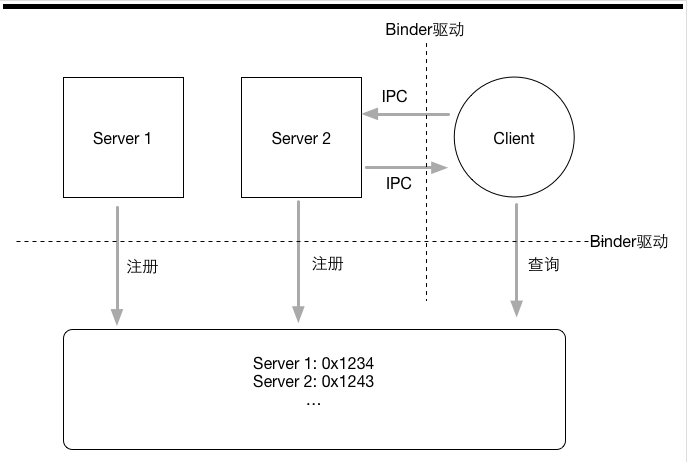
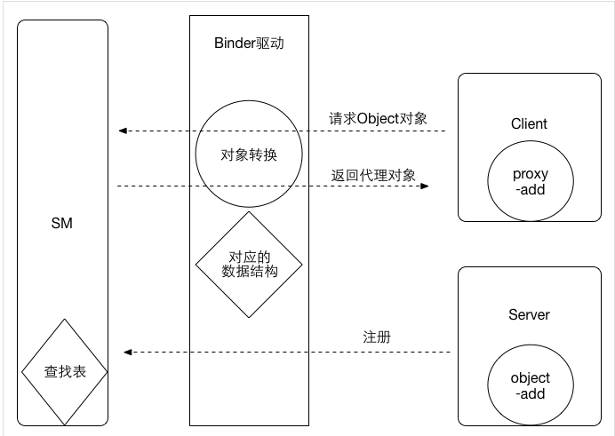

## Handler机制
1. handle提供收发消息的接口。发送消息的时候会把handler自己赋值给msg.target。
2. MessageQueue消息队列。
3. Loop消息循环
4. Loop不断的从MessageQueue中取消息。如果MessageQueue中没有消息，就会阻塞当前线程。
取到消息后通过msg.target.dispatchMessage将消息传递到handler中。如果msg有callback（post方式提交的消息即runnable）这调用callback处理。否则判断handler是否有callback，有则调用callback处理，没有则调用handlerMessage方法处理。
***

## View绘制流程
View绘制经历measure-layout-draw
1. 从View树的根ViewRootImpl的performMeasure()方法开始调用View的measure方法，measure方法调用onMeasure方法如果有子view则调用子view的measure方法。
onMeasure方法的作用是：
* 调用setMeasuredDimension方法设置自己的测量宽高
* 调用子view的measure方法测量子view
2. 从View树的根ViewRootImpl的performLayout()方法开始调用View的layout方法，在layout方法中设置view的left，right，top，bottom的坐标，然后调用onLayout方法布局子view。
3. 从View树的跟ViewRootImpl的performDraw()方法开始调用View的draw方法。View的draw(Canvas)方法中会以此执行
* drawBackground()
* save canvas' Layers
* onDraw()绘制自己
* dispatchDraw()绘制子View
* onDrawForenground()
***

## View事件传递机制

```java
public boolean dispatchTouchEvent(MotionEvent ev){
    if ACTION_DOWN || mFirstTouchTarget != null
        intercept = onInterceptTouchEvent(ev);
    else
        intercept = true;

    if !intercept
        if ACTION_DOWN
            handled = child.dispatchTouchEvent(ev);
            if handled
                mFirstTouchTarget = child;

    if mFirstTouchTarget ==  null
        handled = onTouchEvent(ev);
    else
        if intercept
            ev = ACTION_CANCLE;
        handled = mFirstTouchTarget.dispatchTouchEvent(ev);
        if intercept
            mFirstTouchTarget = null;
    
    return handled;
}
```
1. ACTION_DOWN事件
* 如果本View拦截，直接调用本View的onTouchEvent方法处理
* 如果本View不拦截，将事件传递到子View中处理。如果子View处理此次事件，直接将结果返回。如果子View没有处理本次事件，将事件传递到本View的onTouchEvent中处理。<br/>
**对于ACTION_DOWN事件，如果没有被处理，后续就不会有ACTION_MOVE,ACTION_UP事件传递过来**
2. 非ACTION_DOWN事件
* 有mFirstTouchTarget，不论本View是否拦截本次事件，事件都会直接传递到mFirstTouchTarget中处理。<br/>
**如果本View拦截了本次事件，那么传递到mFirstTouchTarget的是ACTION_CANCLE事件，并且将mFirstTouchTarget设置为null。以后的事件将会直接传递到本View的onTouchEvent中处理**
* 没有mFirstTouchTarget，事件直接传递到本View的onTouchEvent中处理
***
## Binder机制
### 为什么使用Binder？
> Android使用的Linux内核拥有非常多的跨进程通信机制，比如管道，System V,Socket等；为什么还需要单独搞一个Binder出来呢？主要有两点，性能和安全。在移动设备上，广泛地使用跨进程通信肯定对通信机制本身提出了严格的要求；Binder相对传统的Socket方式，更加高效；另外，传统的进程通信方式对于通信双发的身份并没有做出严格的验证，只有在上层协议上进行假设；比如Socket通信ip地址是客户端手动填入的，都可以进行伪造；而Binder机制从协议本身就支持对通信双发做身份校验，因为大大提升了安全性。这个也是Android权限模型的基础。
### Binder通信模型
> 对于跨进程通信的双发，我们姑且叫做Server进程（简称Server），Client进程（简称Client）；由于进程隔离的存在，它们之间没有办法通过简单的方式进行通信，那么Binder机制是如何进行的呢？
回想一下日常生活中我们通信的过程：假设A和B要进行通信，通信的媒介是打电话（A是Client，B是Server）；A要给B打电话，必须知道B的号码，这个号码怎么获取呢？**通信录**。这个通信录就是一张表；内容大致是:
```
1 B -> 123456789
2 C -> 123856974
```
> 先查阅通信录，拿到B的号码；才能进行通信；否则，怎么知道应该拨什么号码？回想一下古老的电话机，如果A要给B打电话，必须先连接通话中心，说明给我接通B的电话；这时候通话中心帮他呼叫B；连接建立，就完成了通信。
另外，光有电话和通讯录是不可能完成通信的，没有基站支持；信息根本无法传达。
我们看到，一次电话通信的过程处理通信双发还有两个隐藏角色；通信录和基站。Binder通信机制也是一样：两个运行在用户空间的进程要完成通信，必须借助内核的帮助；这个运行在内核里面的程序叫做**Binder驱动**，它的功能类似于基站；通信录呢，就是一个叫做**ServiceManager**的东西（简称SM）
ok，Binder的通信模型就是这么简单，如下图：  

整个通信步骤如下：
1. SM建立（建立通信录）；首先有个一进程向驱动提出申请为SM；驱动同意之后，SM集成负责管理Service（注意这里是Service而不是Server，因为如果通信过程反过来的话，那么原来的客户端Client也会成为服务端Server）不过这时候通信录还是空的，一个号码都没有。
2. 各个Server向SM注册（完善通信录）；每个Server端进程启动后，向SM报告，我是zhangsan，要找我请返回0x1234（这个地址没有实际意义，类比）；其他Server进程依次如此；这样SM就建立了一张表，对应着各个Server的名字和地址；
3. Client想要与Server通信，首先询问SM；请告诉我如何联系zhangsan，SM收到后给他一个号码0x1234；Client收到之后，开心滴用这个号码拨通了Server的电话，于是就开始通信了。
### Binder机制跨进程原理
> 上文给给出了Binder的通信模型，指出了通信过程的四个角色：Client，Server，SM，driver；但是我们仍然不清楚Client到底是如何与Server完成通信的。
两个运行在用户空间的进程A和进程B如何完成通信呢？内核可以访问A和B的所有数据；所以，最简单的方式就是通过内核做中转；假设进程A要给进程B发送数据，那么就先把A的数据copy到内核空间，然后把内核空间对应的数据copy到B就完成了；用户空间要操作内核空间，需要通过系统调用；刚好，这里就有两个系统调用：copy_from_user,copy_to_user。
但是，Binder机制并不是这么干的。讲这么一段，是说明进程间通信并不是什么神秘的东西。那么，Binder机制是如何实现跨进程通信的呢？
Binder驱动为我们做了一切。
假设Client进程想要调用Server进程的object对应的一个方法add；对于这个跨进程通信过程，我们来看看Binder机制是如何做的。
首先，Server进程要想SM注册；告诉自己是谁，自己有什么能力；在这个场景就是Server告诉SM，他叫zhangsan，他有一个object对象，可以执行add操作；于是SM建立了一张表：zhangsan这个名字对应进程Server；
然后Client向SM查询：我需要联系一个名字叫做zhangsan的进程里面的object对象；这时候关键来了：进程之间通信的数据都会经过运行在内核空间里面的驱动，驱动在数据流过的时候做了一点手脚，它并不会给Client进程返回一个真正的object对象，而是返回一个看起来跟object一模一样的代理对象objcetProxy，这个objectProxy也有一个add方法，但是这个add方法没有Server进程里面object对象的add方法那个能力；objectProxy的add只是一个傀儡，他唯一做的时间就是把参数包装然后交给驱动。
但是Client进程并不知道驱动返回给它的对象动过手脚，毕竟伪装的太像了，如假包换。Client开开心心地拿着objectProxy对象然后调用add方法；我们说过，这个add什么也不做，直接把参数做一些包装然后直接转发给Binder驱动。
驱动收到这个消息，发现是这个objectProxy；一查表就明白了：我之前用objectProxy替换了object发送给Client了，他真正应该要访问的是object对象的add方法；于是Binder驱动通知Server进程，调用你的object对象的add方法，然后把结果发给我，Server进程收到这个消息，照做之后将结果返回驱动，驱动然后把结果返回给Client进程；于是整个过程就完成了。
由于驱动返回的objectProxy与Server进程里面原始的object是如此相似，给人的感觉好像是直接把Server进程里面的对象object传递到了Client进程，因此，我们可以说Binder对象是可以跨进程传递对象。
但事实上我们知道，Binder跨进程传输并不是真的把一个对象传输到了另外一个进程；传输的过程好像是BInder跨进程穿越的时候，它在一个进程留下了一个真身，在另外一个进程幻化出一个影子；client进程的操作其实是对影子的操作，影子利用Binder驱动最终让真身完成操作。
***

## Android进程级别
1. 前台进程
* 进程持有一个正在和用户交互的Activity
* 进程持有一个service，这个service与用户正在交互的Activity绑定
* 进程持有一个service，这个service是前台运行（startForenground）
* 进程持有一个service，这个service正在执行生面周期方法（oncreate，onstart，onDestroy）
* 进程持有一个BroadcastReceiver,这个BroadcastReceiver正在执行onReceive方法
2. 可见进行
* 进程持有一个Activity，这个Activity可见但不在前台（执行了onPause但没有执行onStop，弹出了dialog）
* 进程持有一个service，这个service和一个可见的activity绑定
3. 服务进程
* 进程持有一个service，这个service通过startservice方法启动但不属于以上两种时
4. 后台进程
* 进程持有一个activity，acitivty运行到了onstop，但没有到onDestroy
5. 空进程
* 进程中不包含活动应用组件

## ThreadPoolExecutor
corePoolSize核心线程数，即使没有任务也会存在
maximumPoolSize 最大线程数
keepAliveTime 如果线程数超过corePoolSize，如果超过keepalivetime就会回收
unit keepAliveTime的时间单位
workQueue 任务执行前保存任务的队列
handler 当线程池由于工作线程数目限制和队列限制导致阻塞的时候，线程池的处理方式

如果线程池中线程的数目小于corePoolSize，就算线程池中有其他没事可做的线程，线程池还是会创建一个新的线程，知道线程池的核心线程数达到corePoolSize
如果线程池中线程的数目大于等于corePoolSize，但是工作队列没有满，那么新的任务会放在任务队列的中，按照FIFO原则依次等待执行
如果线程池中线程数目大于等于corePoolSize，并且工作队列满了，但是线程数小于maximumPoolSize，那么直接创建一个线程处理被添加的任务
如果线程池中线程输入大于等于maximumPoolSize，并且工作队列满了，那么就会用最后一个参数handler处理，默认处理方式是直接丢掉任务，然后抛一个异常。
***

## 内存泄漏怎么查找，怎么产生的
### 内存泄漏产生
1. io资源没有释放
2. listview adapter没有重用convertview
3. activity泄漏
4. bitmap没有释放
5. 没有反注册listener
6. 集合中对象没有清理
### 查找内存泄漏
通过Android studio自动的Monitor，不多操作app，查看内存分配情况是不是已知升高。
***
 ## Android优化
 ### 性能优化
 1. 节制的使用Service。如果应用程序需要使用service来执行后台任务的话，之后当任务正在执行的时候才应该让Service运行起来。当启动一个Service时，系统会倾向于将这个Service所依赖的进程保留，系统可以在LRUcache当中缓存的进程数量也会减少，导致切换程序的时候耗费更多的性能。可以使用IntentService，当后台任务执行结束后会自动停止，避免Service内存泄漏。
 2. 当界面不可见时释放内存。重写Activity的onTrimMemory()方法，然后在这个方法中监听TRIM_MEMORY_UI_HIDDEN这个级别，一旦触发说明用户离开了程序，此时就可以进行资源释放操作了。
 3. 当内存紧张时使用内存，onTrimMemory()方法还有很多种其他类型的回调，可以在手机内存降低时通知我们，我们应该根据会调用传入的级别来均订如何释放应用程序的资源。
 4. 避免在Bitmap上浪费内存，读取bitmap是，可以压缩图片后在读取
 5. 使用优化过的数据集合。Android提供了一系列的优化后的数据集合工具类，如SpareArray，ArrayMap

 ### 布局优化
 1. 重用布局，公共的布局可以抽取出来，引用时通过include引入
 2. 减少布局层次，布局尽量做大宽而窄
 3. 尽在需要时才家在布局 ViewStub
 